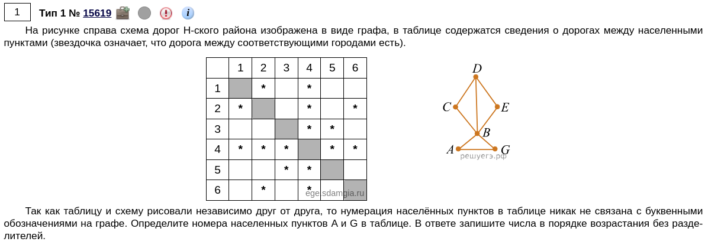

```{python}
from itertools import *

table = '21 12 41 14 42 24 62 26 34 43 35 53 45 54 46 64'  # (1)
graph = 'cd dc de ed db bd cb bc be eb ba ab bg gb ag ga'  # (2)

for p in permutations('abcdefg'):  # (3)
	new_graph = table
	for i in range(1, 7):  # (4)
		new_graph = new_graph.replace(str(i), p[i-1])  # (5)

	if set(graph.split()) == set(new_graph.split()):  # (6)
		print(p)
```

1) Составляем связи для таблицы. Нужно писать только те связи, где есть число (или звездочка, как в нашем случае). Например, на рисунке звездочка стоит в точке (2;1). Т.к. эта таблица симметричная, нужна писать две пары (2 и 1, 1 и 2).
2) Составляем связи для графа так же, как и для таблицы. Ниже покажу способ, который облегчит эту работу.
3) Создаем всевозможные комбинации, которые будем проверять на валидность для нашей задачи.
4) Проходимся по цифрам, которые находятся в нашей таблице. В данном случае, итерация от 1 до 6 включительно.
5) Заменяем каждую цифру из таблицы на буквы из комбинации. Например, если под первым индексом идет буква А, то она заменяет все цифры 1 из переменной `new_graph`. Таким образом, наша таблица с цифрами превращается в граф с буквами.
6) Сравниваем получившийся граф с тем, что мы ожидаем.

- Как видим, у нас несколько вариантов. Но нам нужны только буквы A и G. Если взять любой из вариантов, все равно ответ получится **35**.

-----

- А теперь поговори о том, как облегчить написание связей для графа и таблицы.
- Как уже говорилось, нам нужно писать две пары цифр, т.к. таблица симметричная. Но вместо этого мы напишем только одну пару, а затем с помощью удобств Python автоматически создадим вторую пару.
- Отсылаясь к предыдущей задаче:

```{python}
table = '21 41 42 62 34 35 45 46'  # (1)
table = ' '.join([' '.join((i, i[::-1])) for i in table.split()])  # (2)
print(table)

graph = 'cd de db cb be ba bg ag'  # (3)
graph = ' '.join([' '.join((i, i[::-1])) for i in graph.split()])
print(graph)
```

1) Пишем только одну пару, где есть звездочка.
2) Проходимся по каждой паре. С помощью `(i, i[::-1])` создаем кортеж из двух пар (обычная и перевернутая), который потом превращаем в строку, где эти пары разделены пробелом. Далее список из этих пар превращаем строку, где пары разделены пробелом.
3) С графом делаем то же самое.

- Вы, наверное, скажете, что этот способ сложнее, чем предыдущий. Но с первыми способом вам будет сложнее проверить, потому что
    1) может быть непонятно, какой пары недостает, т.к. будет много чисел;
    2) нужно не забывать писать вторую пару;
    3) может быть трудно вспомнить, вписали вы какую-то пару или нет, из-за чего придется все перепроверять.

-----

- Итоговый шаблон (вместо фигурных скобок поставьте свои значения):

```python
table = '{}'
table = ' '.join([' '.join((i, i[::-1])) for i in table.split()])
graph = '{}'
graph = ' '.join([' '.join((i, i[::-1])) for i in graph.split()])

for p in permutations('{}'):
	new_graph = table
	for i in range(1, {}):
		new_graph = new_graph.replace(str(i), p[i-1])

	if set(graph.split()) == set(new_graph.split()):
		print(p)
```
