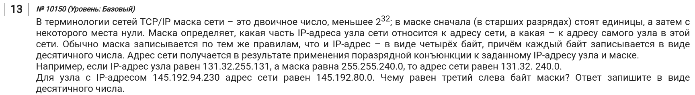

\tableofcontents

\chapter{Введение}

- Некоторые материалы взяты с канала [Евгения Джобса](https://www.youtube.com/@EvgenijJobs).

\chapter{Теория}

\section{Про IPv4}

- **IPv4** -- 4 байта (32 бита) на адрес
- **IPv16** -- 16 байта на адрес
- Для IPv4 используется адрес из 4 чисел, разделенных точкой.
- Каждое число находится в диапазоне от [0; 255].
- Каждое число является восьмибитным (т.е. 1 байт). Например, в случае только 3 цифр в двоичной записи к ней (к записи) будут дописываться нули (в нашем случае, их будет 5).
- Чтобы получить двоичную запись IP-адреса, нужно каждое из четырех чисел перевести в двоичную запись.

\section{Про маски сети}

- **Маска сети** -- 32-битная последовательность, определяющая часть информации об адресе сети и часть номера компьютера.
- Адрес сети и номер компьютера состоят из 32-битной последовательности.
\vspace{1.5em}
- Типичная задача: "Есть IP-адрес 172.37.201.13 и маска сети 255.255.240.0. Найдите адрес сети и номер компьютера."
- Переведем IP-адрес и маску сети в двоичную запись:

\begin{tabular}{ r c}
IP-адрес:& 10101100.00100101.11001001.00001101 \\
Маска сети:& 11111111.11111111.11110000.00000000
\end{tabular}

- Граница из единиц в маске сети будет адресом сети, а нули -- номером компьютера. Эти границы проецируются на IP-адрес:

\begin{tabular}{ r c}
IP-адрес:&\textcolor{blue}{10101100.00100101.1100}\textcolor{red}{1001.00001101} \\
Маска сети:&\textcolor{blue}{11111111.11111111.1111}\textcolor{red}{0000.00000000}
\end{tabular}

- Теперь остается просто перевести получившиеся числа в десятичную запись, дописав необходимое кол-во нулей:

\begin{tabular}{ r c l}
Адрес сети:&\textcolor{blue}{10101100.00100101.1100}0000.00000000 \Rightarrow&  172.37.192.0 \\
Номер компьютера:&00000000.00000000.0000\textcolor{red}{1001}.\textcolor{red}{00001101} \Rightarrow&  2317
\end{tabular}

- Маску сети могут записывать как с помощью четырех чисел, разделенных точкой, так и с помощью числа, которое означает кол-во единиц в маске сети. Например, $192.168.0.0/255.255.255.240 == 192.168.0.0/28$

\section{Про виды адресов}

- В каждой сети есть два зарезервированных адреса:
  - адрес сети
  - широковещательный адрес. Он так называется, т.к., когда на него отправляются данные, он отправляет эти данные другим сетям.
- Адрес сети в "области номера компьютера" имеет **все нули**, а широковещательный адрес - **все единицы**.
- Компьютеру, подключенному к сети IPv4, **нельзя выдать один из зарезервированных адресов**.
- Адрес сети определяется следующим образом:
$$\text{Адрес сети} = \text{IP-адрес}\;\;\&\;\;\text{Маска сети},$$
 где $\&$ - поразрядная конъюнкция.

\chapter{Решения на Python}
\section{Введение}

- Если нужно быстренько перевести адрес в двоичную запись, то можно воспользоваться следющим *однострочником*:

```{python}
ip = [192, 168, 10, 66]
print('.'.join([f'{x:>08b}' for x in ip]))
```

- В данном случае мы пробегаемся ко каждому числу в списковом включении, после чего с помощью f-строки находим двоичную запись числа (`b`), при этом добавив необходимые нули в начало (`>08`)[^1].

---

- В Python есть замечательный модуль `ipaddress`, позволяющий облегчить работу с этим заданием.
- `ipaddress.ip_network(address, strict=True)` - функция, которая поможет работать с адресом сети (она, собственно, возвращает сам адрес сети).
- В аргумент `address` (адрес сети) мы записываем следующее: "IP-адрес/маска сети", хотя ожидается ввод адреса сети.
- Аргумент `strict` лучше ставить со значением `False`, чтобы делать работу функции в нестрогом режиме. Это необходимо, т.к. мы вводим не адрес сети, а запись "IP-адрес/маска сети".

[^1]: [Почитать подробно про форматирование строк в Python](https://docs.python.org/3/library/string.html#formatstrings).

\section{Задачка на поиск третьего слева байта маски}


- Найдем двоичные записи для третьего слева байта маски IP-адреса и адреса сети:

```{python}
print(f'{94:>08b}')
print(f'{80:>08b}')
```

- По формуле нахождения адреса сети можно легко определить маску, особенно её третий слева байт:

\begin{tabular}{ r c }
  IP & 01011110 \\
Mask & 11110000 \\
 Net & 01010000
\end{tabular}

- Теперь переводим получившийся байт в десятичную запись:

```{python}
print(int('11110000', 2))
```

---

- Теперь решим эту задачку программой.
- В маске у нас максимум может быть 32 единицы.
- Все, что нам нужно, -- это проитерироваться по числам от 0 до 32 и определить то число (которое будет маской), которое подходит для адреса сети.

```{python}
from ipaddress import ip_network

NET = '145.192.80.0'
for mask in range(33):
    incorrect_net = f'145.192.94.230/{mask}'
    correct_net = ip_network(incorrect_net, strict=False)
    if str(correct_net.network_address) == NET:
        print(correct_net.netmask)
        break
```

- Атрибут `network_address` отвечает за адрес сети, а `netmask` -- за маску сети.
- Нам нужен третий слева байт. Это \boxed{240}.

- Также есть атрибут `broadcast_address`, который возвращает широковещательный адрес.

\section{Задачка на поиск наименьшего третьего слева байта маски}


- Если сказано, что нужно определить наименьший байт, значит, их будет несколько.

```{python}
from ipaddress import ip_network

NET = '157.17.128.0'
for mask in range(33):
    incorrect_net = f'157.17.164.129/{mask}'
    correct_net = ip_network(incorrect_net, strict=False)
    if str(correct_net.network_address) == NET:
        print(correct_net.netmask)
        break
```

- Ответом будет \boxed{128}.

\section{Задачка на поиск наибольшего кол-ва единиц в двоичной записи маски}


- Для начала найдем последнюю возможную маску для данного адреса сети, затем переведем ее в двоичную запись и посчитаем кол-во единиц:

```{python}
from ipaddress import ip_network

NET = '130.140.240.0'
for mask in range(33):
    incorrect_net = f'130.140.241.137/{mask}'
    correct_net = ip_network(incorrect_net, strict=False)
    if str(correct_net.network_address) == NET:
        print(mask)
```

- Последнее число и будет нашим ответом -- \boxed{23}.

- **Если бы попросили найти кол-во нулей, то мы просто сделали бы вычитание `mask` от 32**.

\section{Задачка на поиск возможных вариантов маски для двух IP-адресов в одной сети}
 

- **Если IP-адреса в одной сети, то их начальная часть (адрес сети) совпадает.**
- Нам нужно найти адрес сети, который будет одинаковым у обоих IP-адресов, а затем посчитать кол-во единиц в его двоичной записи:

```{python}
from ipaddress import ip_network


valid_masks = 0
for mask in range(33):
    incorrect_net_1 = f'201.44.240.33/{mask}'
    incorrect_net_2 = f'201.44.240.107/{mask}'

    net_1 = ip_network(incorrect_net_1, strict=False)
    net_2 = ip_network(incorrect_net_2, strict=False)

    if net_1 == net_2:
        net_address_numbers = map(int, str(net_1.network_address).split('.'))
        bin_net_address = ''.join([f'{x:>08b}' for x in net_address_numbers])
        if bin_net_address.count('1') >= 5:
            valid_masks += 1

print(valid_masks)
```

\section{Задачка на определение кол-ва адресов компьютеров}


- Переведем маску в двоичную запись:

```{python}
print(''.join([f'{x:>08b}' for x in [255, 255, 240, 0]]))
```

- Часть нулей -- часть адресов компьютеров. Нулей 12, значит, всего адресов компьютеров может быть 4096. Но не забываем про доп. условие: два адреса не используют. Значит, ответ: \boxed{4094}.
\vspace{1.5em}
- Более легкий вариант:

```{python}
bin_mask = ''.join([f'{x:>08b}' for x in [255, 255, 240, 0]])
zeroes = bin_mask.count('0')
EXCESS_ADDRESSES = 2
print(2 ** zeroes - EXCESS_ADDRESSES)
```

---

- Решим с помощью модуля `ipaddress`:

```{python}
from ipaddress import ip_network

random_ip = '0.0.0.0'
mask = '255.255.240.0'
net = ip_network(f'{random_ip}/{mask}')
EXCESS_ADDRESSES = 2
print(net.num_addresses - EXCESS_ADDRESSES)
```

- Здесь мы взяли какой-то IP-адрес и воспользовались маской.
- Атрибут `num_addresses` помогает получить кол-во адресов в адресе сети.

\section{Определяем кол-во масок при минимальном кол-ве узлов}
 

- Нам нужной найти адрес сети, у которого будет больше либо равно 28 адресов:

```{python}
from ipaddress import ip_network

NET = '175.122.80.0'
valid_masks = 0
for mask in range(33):
    incorrect_net = f'175.122.80.13/{mask}'
    correct_net = ip_network(incorrect_net, strict=False)
    if str(correct_net.network_address) == NET:
        if correct_net.num_addresses >= 28:
            valid_masks += 1

print(valid_masks)
```

\section{Определяем кол-во IP-адресов в сети с доп. условием}
 

- `ip_network` возвращает класс, по которому можно итерироваться. Объекты, получаемые в ходе итерации по адресу сети, и будут IP-адресами.

```{python}
from ipaddress import ip_network

net = ip_network('202.75.38.160/255.255.255.240')
valid_ips = 0
for ip in net:
    bin_ip = f'{ip:b}'
    if '111' in bin_ip:
        valid_ips += 1

print(valid_ips)
```

- Мы не стали писать списковое включение, т.к. класс `IPv4Network`, которые возвращается функцией `ip_network`, поддерживает удобное конвертирование в двоичную запись.

\section{Определяем номер компьютера в сети}
 

- Будем проходиться по всем IP-адресам в адресе сети, пока не встретим нужный IP-адрес.

```{python}
from ipaddress import ip_network, ip_address

net = ip_network('156.128.0.227/255.255.255.248', strict=False)
IP = '156.128.0.227'
n_comp = 1
for cur_ip in net.hosts():
    if IP == str(cur_ip):
        print(n_comp)
        break

    n_comp += 1
```

- Метод `hosts()` выдает IP-адреса в адресе сети, исключая адрес сети и широковещательный.

\section{Определяем кол-во IP-адресов, для которых числовое значение четырехбайтного IP-адреса кратно четырем}
 

- IP-адрес - это 32-битная последовательность. Если перевести это в байты, то будет 4-байтная последовательность.
- Чтобы получить числовое значение IP-адреса, нужно просто класс `IPv4Network` "засунуть" в `int()`.

```{python}
from ipaddress import ip_network

net = ip_network('0.0.0.0/255.255.128.0', strict=False)
valid_ips = 0
for ip in net:
    ip_numeric_value = int(ip)
    if ip_numeric_value % 4 == 0:
        valid_ips += 1

print(valid_ips)
```
