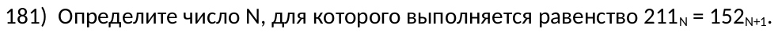

\renewcommand{\contentsname}{Оглавление}

\newpage
\doublespacing
\tableofcontents
\singlespacing

\newpage
\section{Полезные функции}
- Функция для перевода числа из десятичной СС в другую

```python
def convert_to_other_number_system(x: int, ns=2: int):
    """
    x: int
        Number for converting to other number system.
    ns: int
        Number system to which number is converted.
    """
    residues = []
    while x > 0:
        residues = [x % ns] + residues
        x //= ns

    return residues
```
- `docstrings` указаны для пояснения.
- В будущем длинные наименования будут заменены на более короткие.

---

- Функция для перевода числа из одной системы счисления в другую:
```python
def convert_from_other_number_system(digits: list[int], ns: int):
    """
    digits: list[int]
        List of digits of number for converting to decimal.
    ns: int
        Number system from which list of digits is converted.
    """
    return sum([digit * ns ** degree_of_ten \
        for degree_of_ten, digit in enumerate(digits[::-1])])
```

\newpage
\section{Решение задач}
\subsection{Определяем кол-во нулей}
\center  \center

```{python}
def cc(x):
    a = []
    while x > 0:
        a = [x % 25] + a
        x //= 25

    return a

exp = 3 * 3125 ** 8 + 2 * 625 ** 7 - 4 * 625 ** 6 + 3 * 125 ** 5 - \
    2 * 25 ** 4 - 2024
result_converting = cc(exp)
print(result_converting.count(0))
```

\newpage
\subsection{Находим значение переменной для выражения}
\center  \center

```{python}
def from_cc(digits, cc):
    digits = digits[::-1]
    return sum([d * cc ** degree for degree, d in enumerate(digits)])


for x in range(2, 19):
    number_1 = from_cc([9, 0, 0, 9, x], 18)
    number_2 = from_cc([2, 2, 5, 7, x], 18)
    result_exp = number_1 + number_2

    if result_exp % 15 == 0:
        print(result_exp // 15)
        break
```

\newpage
\subsection{Находим значения переменных для выражения}
\center  \center

```{python}
def from_cc(digits, cc):
    digits = digits[::-1]
    return sum([d * cc ** degree for degree, d in enumerate(digits)])


min_sum_vars = float('inf')
answer = None
for x in range(2, 23):
    for y in range(1, 14):
        number_1 = from_cc([x, 2, 3, x, 5], 22)
        number_2 = from_cc([6, 7, y, 9, y], 13)
        result_exp = number_1 - number_2

        if result_exp % 57 == 0:
            if (x + y) < min_sum_vars:
                min_sum_vars = x + y
                answer = result_exp // 57

print(answer)
```

- Переменной `min_sum_vars` обозначим минимальную найденную сумму подходящих `x` и `y`.
- Переменная `answer` будет служить конечным ответом.

\newpage
\subsection{Находим значение переменной как системы счисления}
\center  \center

```{python}
def from_cc(digits, cc):
    digits = digits[::-1]
    return sum([d * cc ** degree for degree, d in enumerate(digits)])


for n in range(2, 100):
    number_1 = from_cc([2, 1, 1], n)
    number_2 = from_cc([1, 5, 2], n + 1)

    if number_1 == number_2:
        print(n)
        break
```

\newpage
\subsection{Находим систему счисления для записей с доп. условием}
\center  \center


```{python}
def cc(x, n):
    a = []
    while x > 0:
        a = [x % n] + a
        x //= n

    return a


for n in range(2, 100):
    exp_1 = cc(56, n)
    exp_2 = cc(45, n)

    if exp_1[-1] == exp_2[-1] == 1:
        print(n)
        break
```

- Другое решение: т.к. при переводе десятичного числа в другую СС мы просто находим остаток от деления, то последняя цифра переведенного числа будет первым остатком. Следовательно, нам нужно просто сравнить остатки:
```{python}
for n in range(2, 100):
    if (56 % n == 1) and (45 % n == 1):
        print(n)
        break
```
