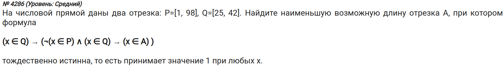

\tableofcontents

\newpage

\chapter{Маленькое введение}

- Нужно перебирать как можно большее кол-во `x, y` и т.д.

- Лучше, конечно, сравнивать результаты при разных диапазонах `x, y` и т.д. Исследовать функцию, так сказать.

- Например, при одном диапазоне у вас получились подходящие числа `A` от 100 до 200. Теперь эти значения (список из чисел от 100 до 200) опять отправьте на обработку, но уже с большим диапазоном `x, y` и т.д. Это поможет вам убедиться в правильности ответа.

\chapter{Решаем задачки с помощью флажка}
\section{Задача \textnumero~349 (Поляков)}


- Пройдемся по всем `A` и создадим флажок, который будет использоваться в качестве сигнала для проверки того, подходят ли значения `A, k, m` или нет:
```python
for A in range(0, 1000):
    flag = True
```

- Проходимся по `k` и `m`:
```python
for k in range(0, 1000):
    for m in range(0, 1000):
```

- Теперь пройдемся по формуле только в том случае, если перед этим наши значения `k, m` были валидными:
```python
if flag:
    exp = (k + 9 * m > 121) or ((k - 13 <= A) and (m + 12 < A))
    if exp is not True:
        flag = False
```

- По завершении этих двух циклов делаем проверку нашего флажка:
```python
if flag is True:
    print(A)
    break
```

**Итоговый код**:
```{python,eval=FALSE}
for A in range(0, 1000):
    flag = True
    for k in range(0, 1000):
        for m in range(0, 1000):
            if flag:
                exp = (k + 9 * m > 121) or ((k - 13 <= A)
                    and (m + 12 < A))
                if exp is not True:
                    flag = False
    if flag:
        print(A)
        break
```

- Получаем ответ: **108**.

\fbox{\parbox{\textwidth}{Т.к. в задании говорится, что нужны неотрицательные значения `k,m`, то они начинаются с нуля. Если бы спрашивались положительные (или натуральные), то начинали бы с единицы.}}

\chapter{Решаем задачки с помощью списковых включений}
\section{Задача \textnumero~360 (Поляков)}


- Напишем функцию, в которую будем закидывать наши значения `A, B, x, y`:
```python
def func(x, y):
    return (y <= ((x - 4) ** 2 + 2 + abs((x - 2)**2 - 16) ))
    == ((y <= 2*(x**2) - 12 * x + A) or (y <= - 4 * x + B))
```

- Пишем итерацию для `A, B`:
```python
for A in range(1000):
    for B in range(1000):
```

- Здесь мы воспользуемся [списковым включением](https://docs.python.org/3/tutorial/datastructures.html#list-comprehensions) и [функцией `all`](https://docs.python.org/3/library/functions.html#all):
```python
results = all(func(x, y) for x in range(1000)
    for y in range(1000))

if results:
    print(A + B)
    exit()
```

- Мы не передаем функции `func(x, y)` значения `A, B`, т.к. пользуемся возможностью [глобальных переменных в Python](https://docs.python.org/3/faq/programming.html#what-are-the-rules-for-local-and-global-variables-in-python) ([статья на русском языке](https://pythonru.com/osnovy/globalnye-peremennye-python)).
- Со значениями `x, y` мы не можем сделать то же самое, т.к. они находятся в [своей области видимости](https://stackoverflow.com/questions/4198906/list-comprehension-rebinds-names-even-after-scope-of-comprehension-is-this-righ).
- Можно, конечно, воспользоваться [моржовым оператором](https://peps.python.org/pep-0572/) и получить следующее *чудо*:
```python
def func():
    return (y <= ((x - 4) ** 2 + 2 + abs((x - 2)**2 - 16) )) \
    == ((y <= 2*(x**2) - 12 * x + A) or (y <= - 4 * x + B))


for A in range(1000):
    for B in range(1000):
        x = None
        y = None
        results = ((x:=x_, y := y_, func()) for x_ in range(1000)
            for y_ in range(1000))

        if all(result[2] for result in results):
            print(A + B)
            exit()
```
- Стоит ли оно того?


**Итоговый код**:
```python
def func(x, y):
    return (y <= ((x - 4) ** 2 + 2 + abs((x - 2)**2 - 16) )) \
    == ((y <= 2*(x**2) - 12 * x + A) or (y <= - 4 * x + B))


for A in range(1000):
    for B in range(1000):
        results = all(func(x, y) for x in range(1000)
            for y in range(1000))

        if results:
            print(A + B)
            exit()
```

- Ответ: **36**

\chapter{Задачи на порязрядную конъюнкцию}
\section{Задача \textnumero~523 (Поляков)}


- Поразрядная конъюнкция в Python обозначается так же: `&`.

- Напишем функцию, в которой будем проверять формулу:
```python
def func(x):
    return ((x & 112 != 0) or (x & 86 != 0)) \
        <= ((x & 65 == 0) <= (x & A != 0))
```

- Затем напишем итерацию по `A` и воспользуемся списковым включением:
```python
for A in range(100):
    results = all(func(x) for x in range(1, 100_000))

    if results:
        print(A)
        break
```

**Итоговый код:**
```python
def func(x):
    return ((x & 112 != 0) or (x & 86 != 0)) \
        <= ((x & 65 == 0) <= (x & A != 0))


for A in range(100):
    results = all(func(x) for x in range(1, 100_000))

    if results:
        print(A)
        break
```

- Ответ: **54**

\chapter{Задачи на наименьшее множество}
\section{Задача \textnumero~88 (Поляков)}


- Создадим пустое множество, в котором должны будут находиться нужные иксы.
- Будем проходить по диапазону и учитывать только те `x`, при которых значение выражения является ложным. Если при каком-то `x` выражение ложно, то это нужный нам икс, который нужно добавить в пустое множество. Т.е. наша функция ложна для данного иска, т.к. он еще не лежит в множестве, которое используется в данной функции.
- Создадим нужные множества:
```python
A = set()
B = {2, 4, 6, 8, 10, 12}
C = {3, 6, 9, 12, 15}
```

- Создадим функцию для проверки выражения:
```python
def func():
    return (x in B) <= (((x in C) and (not (x in A))) \
        <= (not (x in B)))
```

- Пройдемся по какому-то диапазону иксов. Если выражение равно нулю, значит, данный иск подходит нам и входит в множество `A`:
```python
for x in range(1, 100):
    if func() is not True:
        A.add(x)

print(A)
```

**Итоговый код:**
```python
A = set()
B = {2, 4, 6, 8, 10, 12}
C = {3, 6, 9, 12, 15}


def func():
    return (x in B) <= (((x in C) and (not (x in A))) \
        <= (not(x in B)))


for x in range(1, 100):
    if func() is not True:
        A.add(x)

print(sum(A))
```

- В множестве `A` будут лежать числа `12, 6`.

- Ответ: **18**

\section{Задача \textnumero~149 (Поляков)}


- Сгенерируем все 8-битовые цепочки:
```python
from itertools import product
bit8 = [i for i in product('01', repeat=8)]
```
- 8-битовая цепочка состоит из нулей и единиц общей длиной 8

- Создадим множества:
```python
P = set(i for i in bit8 if i.startswith('11'))
Q = set(i for i in bit8 if i.endswith('0'))
A = set()
```

- Создадим функцию для проверки:
```python
def func():
    m = x in A
    n = x in P
    h = x in Q
    return (not m) <= ((not n) and (not h))
```

- Итерируемся для икса:
```python
for x in bit8:
    if func() is not True:
        A.add(x)

print(len(A))
```

**Итоговый код:**
```python
from itertools import product

bit8 = [''.join(i) for i in product('01', repeat=8)]

P = set(i for i in bit8 if i.startswith('11'))
Q = set(i for i in bit8 if i.endswith('0'))
A = set()


def func():
    m = x in A
    n = x in P
    h = x in Q
    return (not m) <= ((not n) and (not h))


for x in bit8:
    if func() is not True:
        A.add(x)

print(len(A))
```

- Ответ: **160**

\chapter{Задачи на наибольшее множество}
\section{Задача \textnumero~12924 (kompege.ru)}


- Идея заключается в том, чтобы создать множество, состоящее из большого кол-ва чисел.
- Затем проходимся по этим числам, и те значения, которые при вызове функции дают ложь, будут лишними.

\fbox{\parbox{\textwidth}{Не стоит путать этот способ с предыдущим, т.к. в прошлый раз наше множество было пустое, и мы заполняли его нужными числами, а теперь нужно просто "отсеить" лишние значения.}}

---

- Создадим множества:
```python
A = set(range(1000))
P = {2, 4, 6, 8, 10, 12, 14, 16, 18, 20}
Q = {3, 6, 9, 12, 15, 18, 21, 24, 27, 30}
```

- Далее создаем функцию для проверки:
```python
def func():
    m = x in A
    n = x in P
    h = x in Q
    return (m <= n) and ((not h) <= (not m))
```

- Итерируемся для икса:
```python
for x in range(1000):
    if func() is not True:
        A.remove(x)

print(len(A))
```

**Итоговый код:**
```python
A = set(range(1000))
P = {2, 4, 6, 8, 10, 12, 14, 16, 18, 20}
Q = {3, 6, 9, 12, 15, 18, 21, 24, 27, 30}


def func():
    return (m <= n) and ((not h) <= (not m))


for x in range(1000):
    if func() is not True:
        A.remove(x)

print(len(A))
```

- Ответ: **3**

\chapter{Задачи на отрезки}
\section{Задача \textnumero~105 (Поляков)}


- Нужно составить множество `A` из чисел, которые будут лежать от самого минимального значения (в нашем случае, это 27) из множеств до самого максимального значения (в нашем случае, это 54) из тех же множеств.
- Лучше брать на единицу отличающиеся значения для диапазона множества `A`.
- Можно взять диапазон и больше, но выполнение кода будет дольше.
- В диапазон берутся не только целые числа, но и десятичные, однако слишком много брать не надо.
- Зачем же берутся десятичные числа? Для проверки ответа. Если ответом будет десятичное число, то оно будет считаться выколотой точкой, т.к. десятичных точек, лежащих на каком-нибудь отрезке, бесконечно много.
- Затем создадим список, в который будем складывать длины всех отрезков.
- При ответе может получиться десятичное число. Его анализ представлен в "\nameref{361}" и в "\nameref{4286}".

---

1) Создадим список, в котором будут храниться все значения от начала и до конца нужных нам отрезков.
```python
Ox = [i/4 for i in range(27 * 4, 54 * 4)]
```

- Деление на 4 Кабанов считает оптимальным выбором.
- В данном случае наш список будет состоять из чисел с шагом 0.25 (т.к. делим на 4).

2) Создадим функцию с проверкой формулы:
```python
def func(x):
    P = (44 <= x <= 49)
    Q = (28 <= x <= 53)
    A = (start <= x <= end)
    return (A <= P) or Q
```

- Переменные `start, end` обсудим в следующем пункте.

3) У нас есть список из чисел, необходимых для множества `A`. Как же выбирать пары из этого списка для определения диапазона этого множества `A`? С помощью функции `itertools.combinations`:
```python
from itertools import combinations


combs = combinations(Ox, 2)
```
- Первый аргумент - итерируемый объект, из которого берутся данные.
- Второй аргумент - длина каждой комбинации.

- Так, мы получим [генераторную функцию](https://docs.python.org/3/reference/datamodel.html#generator-functions), которая поможет создать всевозможное кол-во комбинаций с отрезками, начиная с минимального значения множества `Q` и заканчивая максимальным значением множества `P`.

4) Проитерируемся по этим комбинациям:
```python
valid_lens = []
for (start, end) in combs:
    is_valid_comb = all(func(x) for x in Ox)
    if is_valid_comb:
        valid_lens.append(end - start)

print(max(valid_lens))
```

- Т.к. в задании сказано, что при любом `x` формула должна быть истинной, то мы проверяем все "иксы" из списка `Ox`.
- В список "валидных" отрезков (`valid_lens`) добавляем длину текущего отрезка.

**Итоговый код:**
```{python}
from itertools import combinations


Ox = [i/4 for i in range(27 * 4, 54 * 4 + 1)]


def func(x):
    P = (44 <= x <= 49)
    Q = (28 <= x <= 53)
    A = (start <= x <= end)
    return (A <= P) or Q


combs = combinations(Ox, 2)

valid_lens = []
for (start, end) in combs:
    is_valid_comb = all(func(x) for x in Ox)
    if is_valid_comb:
        valid_lens.append(end - start)

print(max(valid_lens))
```

\section{Задача \textnumero~361 (Поляков, с сайта)} \label{361}


**Итоговый код:**
```{python}
from itertools import combinations


Ox = [i/4 for i in range(1 * 4, 26 * 4 + 1)]

def func(x):
    P = (2 <= x <= 20)
    Q = (15 <= x <= 25)
    A = (start <= x <= end)
    return ((not A) <= (not P)) or Q


combs = combinations(Ox, 2)

valid_lens = []
for (start, end) in combs:
    is_valid_comb = all(func(x) for x in Ox)
    if is_valid_comb:
        valid_lens.append(end - start)

print(min(valid_lens))
```

- Как видим, мы получили десятичное число в качестве ответа. Но ведь длина отрезка не может быть нецелым числом! Будем разбираться.
- Выведем отрезки с их началом и концом, длина которых минимальны, чуть изменив код:
```python
min_len = [0, 0, 0]
for (start, end) in combs:
    is_valid_comb = all(func(x) for x in Ox)
    if is_valid_comb:
        if (end - start) > min_len[2]:
            min_len = [start, end, end - start]

print(min_len)
```

- Мы получаем пару: `[2.0, 14.75, 12.75]`. Но вспомним одну деталь: это мы сделали шаг `0.25`, а ведь он мог быть еще меньше. Получается, что таких чисел на самом деле может быть бесконечно много. Именно поэтому мы берем целые числа.
- Посмотрим, входит ли 15 как конечное число в список валидных чисел (не забывая, что начало отрезка - 2):
```python
for (start, end, len_part) in valid_combs:
    if start == 2 and end == 15:
        print(start, end)
```
- И оно входит. Следовательно, длина валидного отрезка будет `15 - 2 = 13`.
- Ответ: **13**

\section{Задача \textnumero{ 4286} (kompege.ru)} \label{4286}


**Итоговый код:**
```{python}
from itertools import combinations


def func(x):
    P = (1 <= x <= 98)
    Q = (25 <= x <= 42)
    A = (start <= x <= end)
    return Q <= ((not P and Q) <= A)


Ox = [i/4 for i in range(0 * 4, 99 * 4 + 1)]

combs = combinations(Ox, 2)

valid_lens = []
for (start, end) in combs:
    is_valid_comb = all(func(x) for x in Ox)
    if is_valid_comb:
        valid_lens.append(end - start)

print(min(valid_lens))
```

- У нас опять получилось десятичное число.
- Проанализируем валидные пары, длина которых минимальна, как это сделали в предыдущей задаче. У нас получается список из кучи комбинаций, начиная с `0` и заканчивая `98` с шагом `0.25`.
- Самой первой парой будет `(0, 0.25)`.
- Какой же будет ответ? Ответ будет ноль. Наш шаг составляет `0.25`, поэтому программа использует его в качестве ответа.
- Если мы посмотрим на валидные пары, то у них у всех разность в `0.25`, т.е. целого числа нет нигде.
- Именно поэтому ответом будет **0**.
