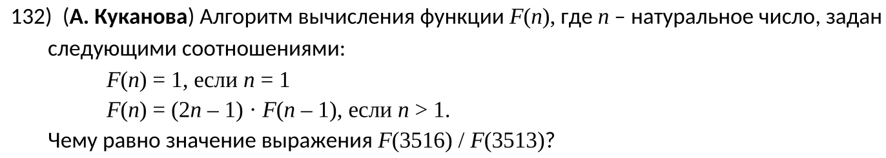
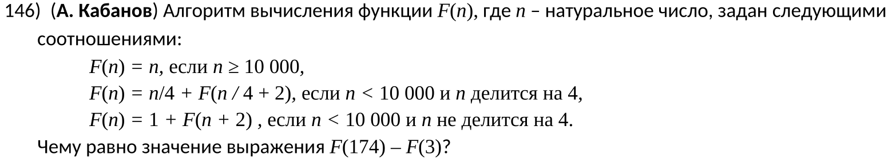
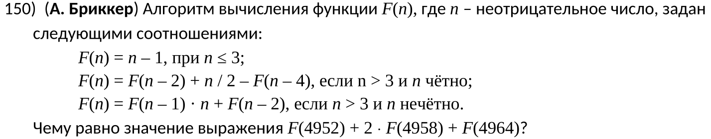
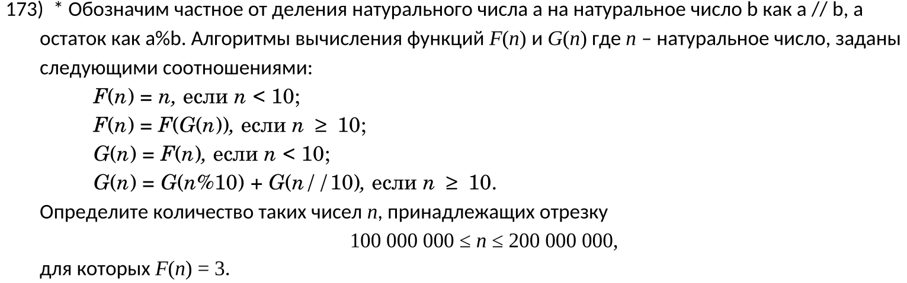
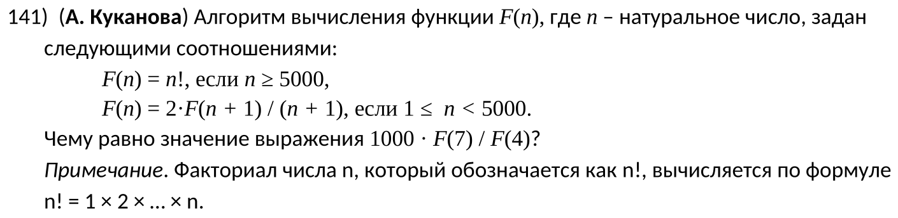

\tableofcontents

\newpage

\chapter{Задачи, связанные с рекурсией}
\section{Задача \textnumero{132} (Поляков)}


1) Напишем функцию:
```python
def F(n):
    if n == 1:
        return 1
    elif n > 1:
        return (2*n - 1) * F(n - 1)
```

2) Сделаем вычисления:
```python
print(F(3416) / F(3413))
```

3) Получим ошибку, т.к. макс. глубина [рекурсии](https://en.wikipedia.org/wiki/Recursion_(computer_science)) по умолчанию составляет 1000.
4) Это можно поменять, установив другую величину с помощью [`sys.setrecursionlimit`](https://docs.python.org/3/library/sys.html#sys.setrecursionlimit):
```python
import sys


sys.setrecursionlimit(10_000)
```

5) Запустим код теперь и получим \boxed{318472033473}

**Итоговый код:**
```python
import sys

sys.setrecursionlimit(10_000)


def F(n):
    if n == 1:
        return 1
    elif n > 1:
        return (2 * n - 1) * F(n - 1)


print(F(3416) / F(3413))
```

\section{Задача \textnumero{146} (Поляков)}


1) Увеличим лимит рекурсии:
```python
import sys

sys.setrecursionlimit(10_000)
```

2) Напишем функцию:
```python
def F(n):
    if n >= 10_000:
        return n
    elif n < 10_000 and n % 4 == 0:
        return n / 4 + F(n / 4 + 2)
    elif n < 10_000 and n % 4 != 0:
        return 1 + F(n + 2)
```

3) Выведем результат:
```python
print(F(174) - F(3))
```

4) Получаем ответ: \boxed{67}
\chapter{Задачи, связанные с кешированием (мемоизацией)}
\section{Задача \textnumero{150} (Поляков)}


1) Напишем функцию:
```python
def F(n):
    if n <= 3:
        return n - 1
    elif n > 3 and n % 2 == 0:
        return F(n - 2) + (n / 2) - F(n - 4)
    elif n > 3 and n % 2 != 0:
        return F(n - 1) * n + F(n - 2)
```

2) Выведем результат:
```python
print(F(4952) + 2 * F(4958) + F(4964))
```

3) Получим проблему с лимитом рекурсии и быстро исправим её.
4) Алгоритм работает слишком долго (к тому же это потребляет ресурсы компьютера). Нам нужно как-то ускорить работу функции. Именно поэтому мы воспользуемся кешированием (так же называемой [мемоизацией](https://en.wikipedia.org/wiki/Memoization)), воспользовавшись декоратором `functools.lru_cache`:
```python
from functools import lru_cache

@lru_cache
def F(n):
    ....
```

4) Получим ответ: \boxed{9920}

**Итоговый код:**
```python
import sys
from functools import lru_cache

sys.setrecursionlimit(10_000)


@lru_cache
def F(n):
    if n <= 3:
        return n - 1
    elif n > 3 and n % 2 == 0:
        return F(n - 2) + (n / 2) - F(n - 4)
    elif n > 3 and n % 2 != 0:
        return F(n - 1) * n + F(n - 2)


print(F(4952) + 2 * F(4958) + F(4964))
```

\section{Задача \textnumero{173} (Поляков)}


1) Напишем функции:
```python
from functools import lru_cache


@lru_cache
def F(n):
    if n < 10:
        return n
    elif n >= 10:
        return F(G(n))


@lru_cache
def G(n):
    if n < 10:
        return F(n)
    elif n >= 10:
        return G(n % 10) + G(n // 10)
```

2) Проитерируемся по нужному диапазону:
```python
k = 0
for n in range(100_000_000, 200_000_001):
    if F(n) == 3:
        k += 1
print(k)
```

3) Придется немного подождать, чтобы получить ответ: \boxed{11111111}

\subsection{Исследуем функцию}

- Выведем результаты работы функции для чисел из дипазона от 10 до 40:
```python
for n in range(10, 40):
    print(n, F(n))
```

- Можно заметить, что значение функции всегда будет идти от 1 до 9, затем обнуляться и опять идти от 1 до 9. Это закономерность, которая пригодится нам. Это все потому, что мы `n` делим на 10 или находим остаток от деления на 10.
- В задаче сказано, что нужно кол-во чисел, которые при вызове функции дают значение 3.
- В нашем эксперименте такими числами являются `12, 21, 30, 39`. Не замечаете закономерность? Начиная с 12, мы просто прибавляем 9 каждый раз. Следовательно, можно составить список из чисел, при которых функция будет равна 3:
```python
cur_n = 12
results = []
start, end = 100_000_000, 200_000_000
for _ in range(100_000_000):
    cur_n += 9

    if cur_n > end:
        break

    if start <= cur_n <= end:
        results.append(cur_n)

print(len(results))
```
- Взял такое большое число для итерации, т.к. в условии указан большой диапазон.
- И мы получаем правильный ответ: \boxed{11111111}

\chapter{Интересные задачи}
\section{Задача \textnumero{141} (Поляков)}


1) Импортируем библиотеку `math`:
```python
import math
```

2) Составим функцию:
```python
import sys
from functools import lru_cache

sys.setrecursionlimit(10_000)


@lru_cache
def F(n):
    if n >= 5000:
        return math.factorial(n)
    elif 1 <= n < 5000:
        return 2 * F(n + 1) / (n + 1)
```

3) Сделаем вывод результата:
```python
print(1000 * F(7) / F(4))
```

4) Получаем исключение `OverflowError: integer division result too large for a float`. Python'у не позволено выполнять операции над такими большими числами. Чтобы Python сразу не вычислял деление, а оставлял операцию в формате `a/b`, нужно воспользоваться [классом `fractions.Fraction`](https://docs.python.org/3.1/library/fractions.html):
```python
from fractions import Fraction


@lru_cache
def F(n):
    ...
        return 2 * Fraction(F(n + 1), (n + 1))
```
5) Если мы попытаемся вычислить `math.factorial(5000)`, то получим исключение `ValueError: Exceeds the limit (10000 digits) for integer string conversion`. Чтобы [позволить Python выполнять такие большие операции](https://docs.python.org/3/library/stdtypes.html#integer-string-conversion-length-limitation), нужно вызвать [функцию `sys.set_int_max_str_digits`](https://docs.python.org/3/library/sys.html#sys.set_int_max_str_digits):
```python
import sys


sys.set_int_max_str_digits(0)
```

**Итоговый код:**
```python
import math
import sys
from fractions import Fraction
from functools import lru_cache

sys.set_int_max_str_digits(0)
sys.setrecursionlimit(10_000)


@lru_cache
def F(n):
    if n >= 5000:
        return math.factorial(n)
    elif 1 <= n < 5000:
        return 2 * Fraction(F(n + 1), (n + 1))


print(1000 * F(7) / F(4))
```

6) Получаем ответ: \boxed{26250}

- Чтобы избавиться от проблема с нахождением факториала, можно написать собственную функцию:
```python
def fact(n):
    x = 1
    for i in range(2, n + 1):
        x *= i
    return n
```

- Остается заменить `math.factorial` на `fact(n)`.
