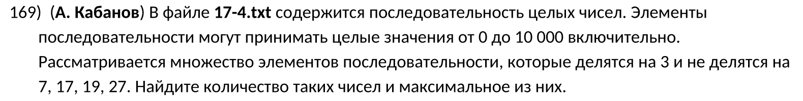
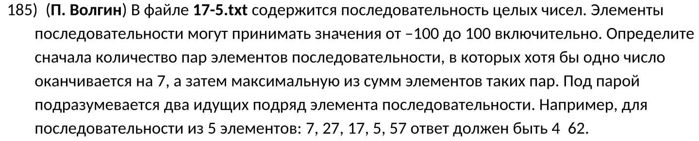
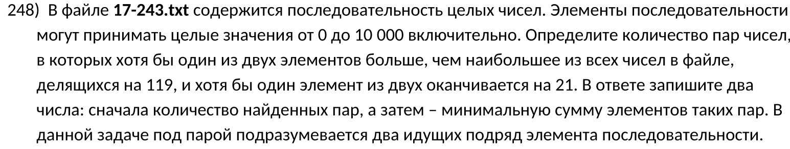
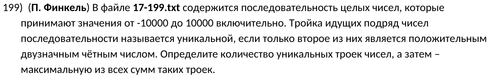

\tableofcontents
\newpage

\chapter{Нахождение длины последовательности и максимального числа}
\section{Задача \textnumero{169} (Поляков)}



1) Откроем файл:
```python
with open('17-4.txt', encoding='utf-8') as file:
```

2) Прочитаем каждую строчку из файла:
```python
    lines = file.readlines()
```

3) Сделаем форматирование этих строчек в числа и создадим список для дальнейшего заполнения валидными числами:
```python
    numbers = [int(line) for line in lines]
    valids = []
```

4) Создадим цикл, в котором будем обрабатывать нужные нам цифры:
```python
    for n in numbers:
```

5) Создадим переменную, в которой будем хранить истинность либо ложность того, что текущее число не делится на 7, 17, 19 и 27:
```python
        is_valid_n = all(n % divider != 0 for divider in [7, 17, 19, 27])
```
6) Сделаем проверку числа:
```python
        if (n % 3 == 0) and is_valid_n:
            valids.append(n)
```
7) Выведем кол-во чисел и макс. число:
```python
    print(len(valids), max(valids))
```

- Ответ: **445 9738**

**Итоговый код:**
```python
with open('17-4.txt', encoding='utf-8') as file:
    lines = file.readlines()
    numbers = [int(line) for line in lines]
    valids = []

    for n in numbers:
        is_valid_n = all(n % divider != 0
            for divider in [7, 17, 19, 27])
        if (n % 3 == 0) and is_valid_n:
            valids.append(n)

    print(len(valids), max(valids))
```

- Открытие кода можно сократить до одной строчки (но [не стоить забывать про закрытие файла](https://stackoverflow.com/questions/25070854/why-should-i-close-files-in-python)):
```python
numbers = [int(number) for number in open('17-4.txt')]
```

\chapter{Пары чисел}
\section{Задача \textnumero{185} (Поляков)}



- Под парой чисел подразумевается два ближайших чисал. Например, есть список `[1, 2, 3, 4]`. Парами подряд идущих чисел этого списка будут: `[1, 2], [2, 3], [3, 4]`.
- В Python подобную логику можно оформить с помощью [функции `zip`](https://docs.python.org/3/library/functions.html#zip).

1) Подготовим числа:
```python
with open('17-5.txt', encoding='utf-8') as file:
    numbers = [int(line) for line in file.readlines()]
    sums = []
```

2) Создадим цикл, в котором будем итерироваться по каждой паре подряд идущих чисел. Числа пары распакуем в переменные `n, n_2`:
```python
    for (n, n_2) in zip(numbers, numbers[1:]):
```

- Можно воспользоваться индексацией:
```python
for n in range(len(numbers) - 1):
```
- Здесь `numbers[n]` - будем первым числом пары, а `numbers[n + 1]` - вторым.

3) Будем обрабатывать эти числа:
```python
        if str(n)[-1] == '7' or str(n_2)[-1] == '7':
            sums.append(n + n_2)
```

4) Выведем нужные данные:
```python
    print(len(sums), max(sums))
```

- Ответ: **16 159**

**Итоговый код:**
```python
with open('17-5.txt', encoding='utf-8') as file:
    numbers = [int(line) for line in file.readlines()]
    sums = []

    for (n, n_2) in zip(numbers, numbers[1:]):
        if str(n)[-1] == '7' or str(n_2)[-1] == '7':
            sums.append(n + n_2)

    print(len(sums), max(sums))
```

\section{Задача \textnumero{248} (Поляков)}



1) Подготовим числа:
```python
with open('17-243.txt', encoding='utf-8') as file:
    numbers = [int(line) for line in file.readlines()]
    sums = []
```

2) Найдем все числа, которые делятся на 119:
```python
    div_119 = [n for n in numbers if n % 119 == 0]
    max_div = max(div_119)
```

3) Теперь проходимся по парам последовательности:
```python
    for (n, n_2) in zip(numbers, numbers[1:]):
        cond = (n > max_div) or (n_2 > max_div)
        cond_2 = (str(n)[-2:] == '21') or (str(n_2)[-2:] == '21')
        if cond and cond_2:
            sums.append(n + n_2)
```

4) Выведем результаты:
```python
    print(len(sums), min(sums))
```

- Ответ: **7 11037**

**Итоговый код:**
```python
with open('17-243.txt', encoding='utf-8') as file:
    numbers = [int(line) for line in file.readlines()]
    sums = []

    div_119 = [n for n in numbers if n % 119 == 0]
    max_div = max(div_119)

    for (n, n_2) in zip(numbers, numbers[1:]):
        cond = (n > max_div) or (n_2 > max_div)
        cond_2 = (str(n)[-2:] == '21') or (str(n_2)[-2:] == '21')
        if cond and cond_2:
            sums.append(n + n_2)

    print(len(sums), min(sums))
```

\section{Задача \textnumero{199} (Поляков)}



- В данном решении я буду использовать регулярные выражения (почему-бы и нет?).

1) Подготовим числа:
```python
import re


with open('17-199.txt', encoding='utf-8') as file:
    numbers = [int(line) for line in file.readlines()]
    sums = []
```

2) Начнем итерацию по тройкам последовательности:
```python
    for (n, n_2, n_3) in zip(numbers, numbers[1:], numbers[2:]):
        cond_n = [
            re.match('^\d[02468]$', str(n)),
            re.match('^\d[02468]$', str(n_2)),
            re.match('^\d[02468]$', str(n_3)),
        ]
        if cond_n[1] and (cond_n[0] == cond_n[2] == None):
            sums.append(n + n_2 + n_3)
```

- С помощью [паттерна](https://docs.python.org/3/howto/regex.html#simple-patterns) `'^\d[02468]$'` я проверил, является ли число положительным двузначным четным.
- Можно было решить с помощью того факта, что второе число должно быть больше 9, но меньше 100, и при этом оно четное.
    - Например, создадим функцию, которая будет проверять условия для второго числа:
    ```python
    def func(x):
        return (10 <= x <= 99) and (x % 2 == 0)
    ```
    - В условии напишем следующее:
    ```python
    if (func(n) == func(n_3) == False) and func(n_2):
        ...
    ```
    - "Полную" функции можно было заменить lambda-функцией:
    ```python
    func = lambda x: (10 <= x <= 99) and (x % 2 == 0)
    ```

3) Выведем результаты:
```python
    print(len(sums), max(sums))
```

- Ответ: **7 12441**

**Итоговый код:**
```python
import re

with open('17-199.txt', encoding='utf-8') as file:
    numbers = [int(line) for line in file.readlines()]
    sums = []

    for (n, n_2, n_3) in zip(numbers, numbers[1:], numbers[2:]):
        cond_n = [
            re.match('^\d[02468]$', str(n)),
            re.match('^\d[02468]$', str(n_2)),
            re.match('^\d[02468]$', str(n_3)),
        ]
        if cond_n[1] and (cond_n[0] == cond_n[2] == None):
            sums.append(n + n_2 + n_3)

    print(len(sums), max(sums))
```

\chapter{Полезные советы}

- Если нужно проверить оканчивается ли число в какой-либо системе на какую-то букву, то
    1) Нужно взять модуль для этого числа, т.к. при делении отрицательного числа на положительное получится [не тот ответ, который вы ожидаете](https://stackoverflow.com/questions/19517868/integer-division-by-negative-number).
    2) Найти остаток от деления данного числа, причем остатком должен быть кодовый номер буквы (например, в 16-ричной буква А обозначается как 10).
    - Получим следующую запись: `abs({число}) % {система счисления} == {кодовый номер буквы}`

- Если в азадании говорится о тройках (или большем кол-ве чисел), то просто добавьте еще один срез в функцию `zip`:
```python
for (n, n_2, n_3) in zip(numbers, numbers[1:], numbers[2:])
```

- Если нужно проверять слишком много окончаний у какого-то числа (например, что число оканчивается на 1, 2 или 3), то можно воспользоваться [регулярными выражениями](https://docs.python.org/3/howto/regex.html):
```python
import re

if re.match('^\d*[123]', n):
    ...
```

- Если в задании говорится о нахождении "хотя бы двух из трех элементов" (или что-то в этом роде), то лучше воспользоваться сложением логических условий, т.е. вы используете какое-то выражение (функцию) для каждого из чисел, а потом их результаты (которые будут либо `True`, либо `False`) складываете.
