\tableofcontents

\chapter{Маленькое введение}
Динамическое программирование - подход, при котором большая задача разбивается на кучу маленьких.

\chapter{Без границ}
1) Копируем ячейки и переносим их чуть ниже. Замечание: когда вставляете текст, не забудьте нажать кнопку "Форматировать". В LibreOffice: "Paste Special" -> "Paster Special" -> "Formats Only"
2) В начальной клетке (в той таблице, которую скопировали на предыдущем шаге) сумма равна самому числу. Причем нужно ссылаться на первую ячейку из предыдущей таблицы (например, \texttt{A1}).
3) В следующих ячейках будет сложение текущей ячейки с предыдущей минимальная/максимальная (в зависимости от задачи) сумма.
- Под "текущей ячейкой" подразумевается проекция текущей ячейки на предыдущую таблицу. Например, если вы сейчас находитесь в ячейке, которая слева на две ячейки и сверху на 5 ячеек (от начала таблицы), то берете такие же "координаты" из предыдущей таблицы.

---

\section{Задача \textnumero{96} (Поляков)}
1) Скопируем таблицу.
2) Сделаем ссылку для первого элемента из предыдущей таблицы.

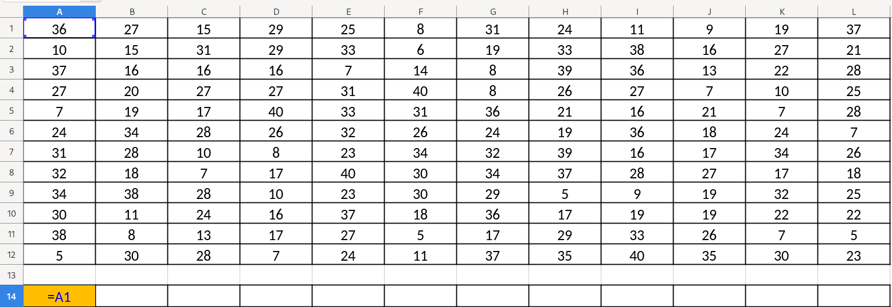
3) Теперь сделаем ссылки для горизонтальных ячеек первой строки. Т.к. вариантов того, чтобы сверху что-то было нет, то единственный вариант - сложение с предыдущей ячейкой слева:

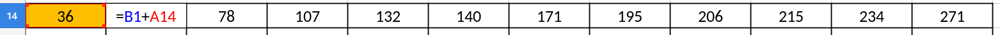
4) То же самое делаем и для вертикальных ячеек первого столбца, т.к. им неоткуда получать другие данные:

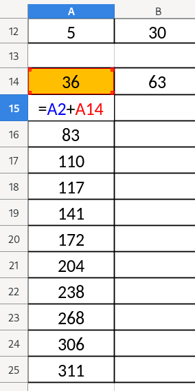{height=400px}

5) Как сказано в задании: если мы передвинемся вниз-вправо, то получим двойное вознаграждение. В LibreOffice лучше пользоваться английскими названиями функций!

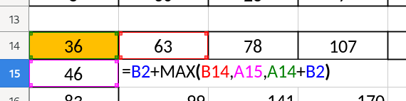{height=400px}

- Здесь мы добавили к \texttt{A14} еще \texttt{B2}, т.к. нужно сделать двойное вознаграждение. Например, запись \texttt{A14 + B2 + B2} будет считаться двойным вознаграждением.

6) Далее просто продолжаем данную формулу для остальных ячеек и получаем максимальное значение в правой нижней ячейке - \boxed{740}

7) Чтобы найти минимум, нужно просто заменить функцию \texttt{MAX} на \texttt{MIN}. Получаем ответ: \boxed{353}

\section{Задача \textnumero{97} (Поляков)}

1) То же самое, как и с предыдущей задачей, только начинать будем с правого верхнего угла:

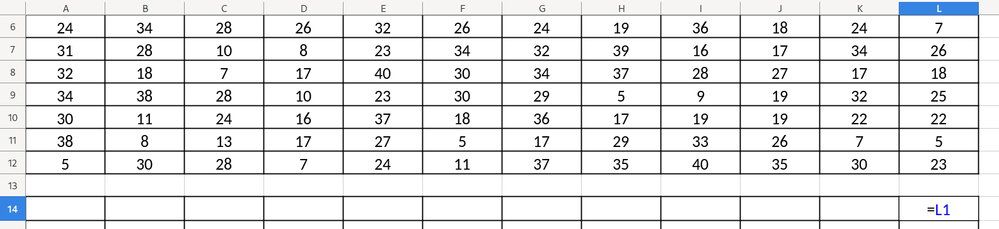

2) Делаем вертикальные и горизонтальные "движения":

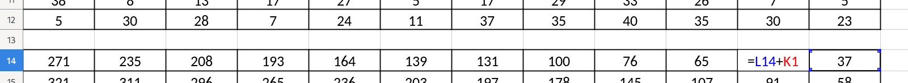
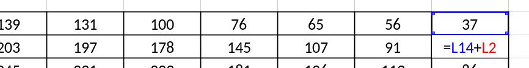

3) Делаем движение по диагонали:

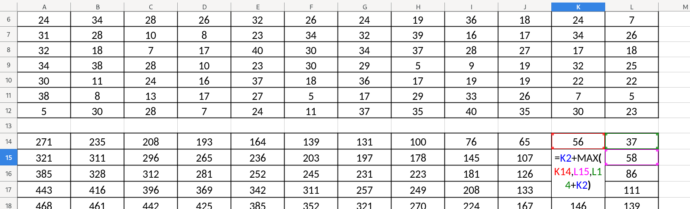

4) Получаем ответ в левом нижнем углу: \boxed{716}.

5) Для минимальной суммы делаем то же самое, только меняем функцию на \texttt{MIN} и получаем ответ: \boxed{338}.

\chapter{С границами}
\section{Задача \textnumero{87} (Поляков)}

- Грницы в данных задачах означают, что некоторые действия, данные в условии задачи, нельзя будет выполнить.
1) Подготовим таблицу для работы с ней.
2) Продлеваем значения ячеек до границ.
3) В следующую ячейку мы не сможем попасть никаким из доступных способов:

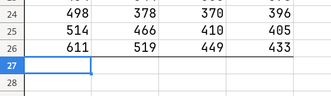

4) В следующей ячейке следует быть осторожным, ведь мы можем достичь ее только движением вниз из верхней. Следовательно, ячейке, отвечающую за левую сторону следует удалить:

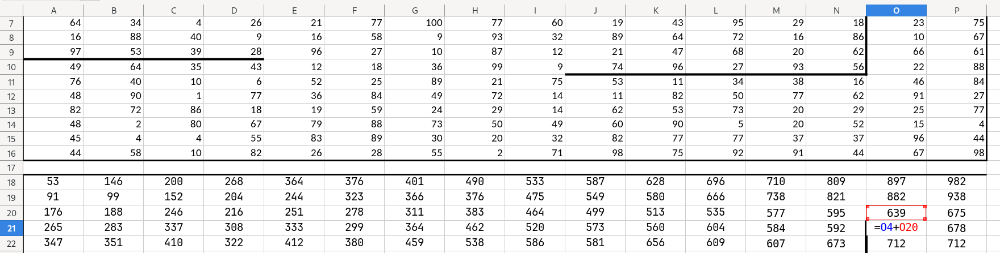{height=300px}

- Как только возможность для выполнения других действия открывается, ее нужно использовать.

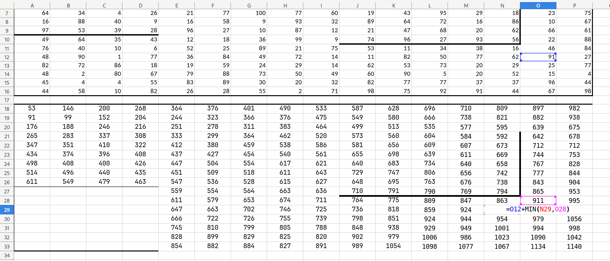

5) Для остальных "опасных" ячеек аналогичное рассуждение.
6) Получаем максимальное число: \boxed{2343}.
7) Для нахождения минимального мы просто меняем функции и получаем ответ: \boxed{1140}.

\chapter{Запретные ячейки}

- Бывают задачи, где клетки с определенным значением являются стеной, горой и т.д.
- Чтобы решить подобные задачи, нужно такие ячейки как бы "выделить". Например, можно заменить их значение на очень большое.
- Если нам нужно найти максимальное число вознаграждений, то такие ячейки нужно заменить на очень маленькие (-100000, например), а если минимальное число - на большие. Когда формула будет их проходить, она просто не будет учитывать их значения, т.к. они всегда будут "проигрывать" в сравнении с другими значениями.
