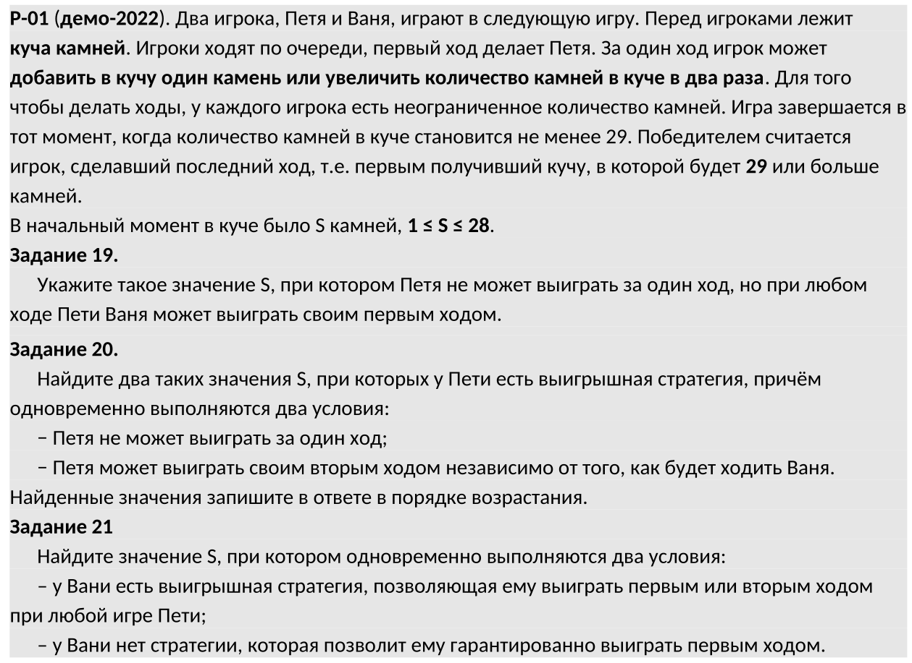
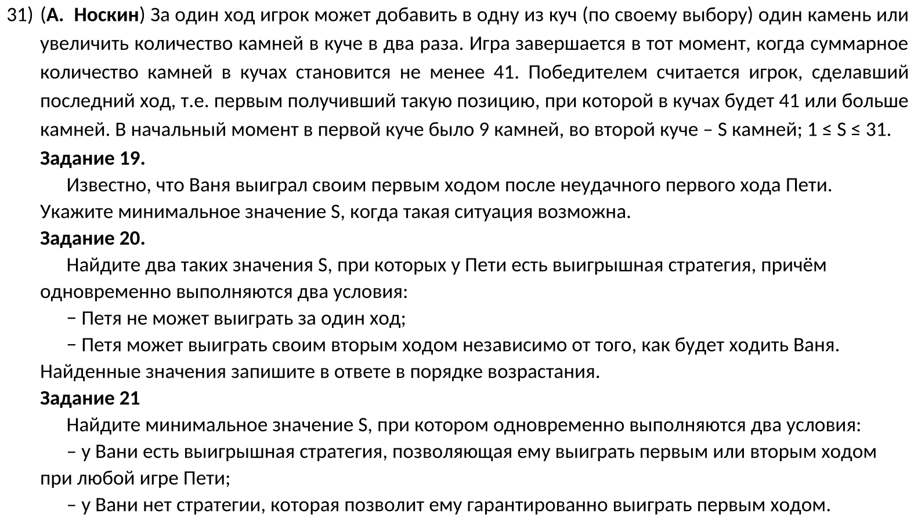

\tableofcontents

\chapter{Код-шаблон}

- Огромное спасибо Алексею Кабанову за [объяснение данного кода](https://www.youtube.com/watch?v=hhi4qCWPR7w).

- Тот игрок, для которого нужна победа, будет называться "целевым".
- У целевого игрока переменная `steps` всегда будет четной.
1) Напишем функцию, которая принимает два параметра: кол-во камней и кол-во оставшихся ходов.
```python
def func(rocks, steps):
```
2) Если кол-во камней оказалось больше максимального, то игра завершается.
    - Можно проверить, равно ли кол-во ходов нулю. Если это так, то значит все ходы были истрачены, причем победил тот, кто сделал этот последний ход.
    - Но тут еще нужна проверка на четность, т.к. игра может закончиться на ходе того участника, чьи ходы приведут к нулю шагов, т.е. когда игра закончится.

```python
    if rocks >= N:
        return steps % 2 == 0
```

- Вместо `N` подставьте свое максимальное значение камней.

3) Если же камней еще достаточно, а ходы закончились, то и игра закончилась.
```python
    if steps == 0:
        return 0
```
4) Если осталось нечетное кол-во ходов, то для победы должны сработать стратегии со всеми возможными действиями.
- Необходимо, чтобы все варианты, развивающиеся из этих действий (рекурсивные вызовы функции `func`), были выигрышными (для целевого игрока, у которого переменная `steps` всегда четная).
- Получается, для противника все эти действия должны быть проигрышными.
```python
    if (steps - 1) % 2 != 0:
        return func(rocks + 1, steps - 1) and \
        func(rocks * 2, steps - 1)
```

- Минус один сделали для того, чтобы у целевого игрока переменна `steps` всегда была четной. Например, мы делаем вызов функции `func(30, 1)` - это значит, что Петя должен выиграть за один ход. Если мы уберем вычитание единицы, то функция будем думать, что мы на данный момент в роли противника (у которого переменная `steps` нечетная). Именно поэтому и делается вычитание единицы.
- Вызов `func(30, 2)` - начинает Петя (играющий за нечетные), потому все остальные развивающиеся вызовы должны быть выигрышными, т.к. Ваня должен победить.

5) Если осталось четное кол-во ходов, то целевому игроку для победы достаточно выигрыша одного из возможных действий.
```python
    return func(rocks + 1, steps - 1) or \
        func(rocks * 2, steps - 1)
```

- Если начальное кол-во ходов нечетное, то ищем победу для Пети, если четное - для Вани.

**Итоговый код:**
```python
def func(rocks, steps):
    if rocks >= N:
        return steps % 2 == 0
    if steps == 0:
        return 0

    if (steps - 1) % 2 != 0:
        return func(rocks + 1, steps - 1) and \
        func(rocks * 2, steps - 1)
    return func(rocks + 1, steps - 1) or \
        func(rocks * 2, steps - 1)
```

- Последнее условие можно сократить до двух строчек:
```python
variants = [func(rocks + 1, steps - 1), func(rocks * 2, steps - 1)]
return any(variants) if (steps - 1) % 2 == 0 else all(variants)
```
- Здесь `any` будет выполнять роль "хотя бы одной победы", а `all` - обязательной победы для целевого игрока.

- Далее локальные переменные функции будут сокращены до одной буквы.

\chapter{Задачи на одну кучу}
\section{Задача \textnumero{P00} (Поляков)}



1) Напишем функцию:
```python
def func(r, s):
    if r >= 29:
        return s % 2 == 0
    if s == 0:
        return 0

    v = [func(r + 1, s - 1), func(r * 2, s - 1)]
    return any(v) if (s - 1) % 2 == 0 else all(v)
```

\subsection{Задание 19}
2) Напишем списковое включение:
```python
print(19,
    [r for r in range(1, 29) if (not func(r, 1)) and func(r, 2)]
)
```
- Т.к. Петя не может выиграть первым ходом, то делаем условие для тех `r`, при которых первый ход (т.е. ход Пети) будет проигрышным. Ваня же должен выиграть, потому вызов функции для него должен быть истинным (т.е. выигрышным).
- Находим мин. число и получаем ответ: **\boxed{14}**

\subsection{Задание 20}
3) Напишем следующее списковое включение:
```python
print(20,
      [r for r in range(1, 29) if (not func(r, 1)) and func(r, 3)]
)
```
- Получаем ответ: **\boxed{7 13}**
- Т.к. Петя должен победить вторым ходом (по общему кол-ву ходов это будет третий), а ход Вани неважен, то просто пишем `func(r, 3)`.

\subsection{Задание 21}
4) Наконец, найдем ответ для последнего:
```python
print(21,
      [r for r in range(1, 29) if (not func(s, 2)) and func(s, 4)]
)
```
- Получаем ответ: **\boxed{12}**
- Т.к. оба условия должны выполняться одновременно, Ваня не сможет выиграть первым ходом.

\chapter{Задачи с двумя кучами}
\section{Задача \textnumero{31} (Поляков)}



- Мы добавим одну переменную к нашей функции и все!
1) Напишем функцию:
```python
def func(r, r_2, s):
    if (r + r_2) >= 41:
        return s % 2 == 0
    if s == 0:
        return 0

    v = [
        func(r + 1, r_2, s - 1),
        func(r * 2, r_2, s - 1),
        func(r, r_2 + 1, s - 1),
        func(r, r_2 * 2, s - 1),
    ]
    return any(v) if (s - 1) % 2 == 0 else all(v)
```
- При проверке на перех допустимого числа камней нужно найти суммарное кол-во двух куч.
- Как видим, здесь добавилось два варианта развития событий. Т.к. кучи две, а действий тоже два, то всего получается 4 вызова функции.
\subsection{Задание 19}
2) Пишем следующее:
```python
print(19, min([r for r in range(1, 32) if func(9, r, 2)]))
```
- У нас ничего не выходит. Дело в том, что при вызове функции мы как бы говорим, что нам нужный те `r`, при которых Ваня победит первым ходом из любого хода Пети. Но в задании же сказано, что Петя допустил неудачное решение. Следовательно, нам нужен только этот случай, когда Петя допустил ошибку.
- Т.к. в данном случае Петя будет ходить при нечетных `s`, то нужно заменить `all` на `any` в нашей функции. Сократим возвращение:
```python
    return any(v)
```

- Получаем ответ: **\boxed{5}**

\subsection{Задание 20}
3) Возвращаем функцию в предыдущее состояние.
4) Пишем результат для следующего задания:
```python
print(20, [r for r in range(1, 32)
    if (not func(9, r, 1)) and func(9, r, 3)])
```

- Получаем ответ: **\boxed{4 15}**

\subsection{Задание 21}
5) Найдем результат для последнего:
```python
print(21, [r for r in range(1, 32)
    if (not func(9, r, 2)) and func(9, r, 4)])
```

- Получаем ответ: **\boxed{14}**
