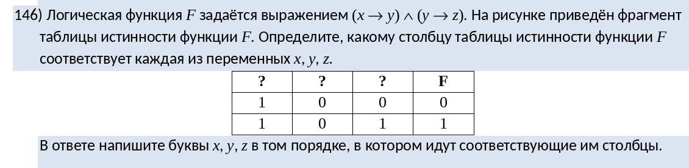
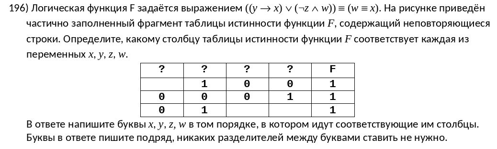
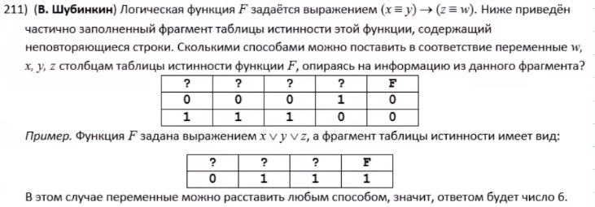
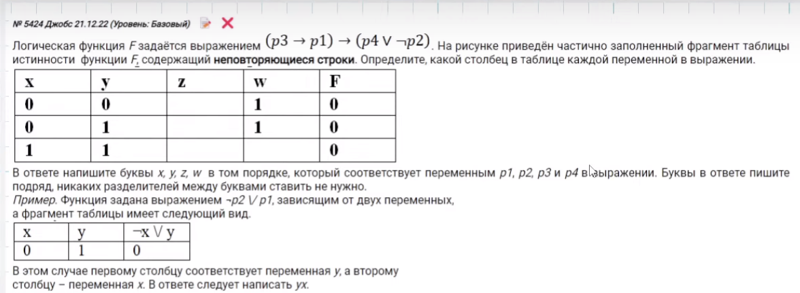

\center \section{Когда таблица полностью заполнена} \center

\center {width=100%} \center

```{python}
from itertools import *


def f(*, x, y, z):
    return (x <= y) and (y <= z)


table = [
    (1, 0, 0),
    (1, 0, 1)
]

for p in permutations('xyz'):
    rows = [dict(zip(p, row)) for row in table]  # (1)
    tbls = [f(**row) for row in rows]  # (2)
    if tbls == [0, 1]:  # (3)
        print(p)
```

- Допустим, нам попалась комбинация `xzy`.

1) Сначала мы создаем словари, парами которых будут "буква-число". Например, для `y` будет число 0 в первой строчке, а во второй - число 1.

```{python}
table = [
    (1, 0, 0),
    (1, 0, 1)
]

print(*[dict(zip('xzy', row)) for row in table], sep='\n')
```

2) Затем проходимся по этим словарям, а их значения [^1] закидываем в функцию. Один словарь = одна строка таблицы. Здесь же получаем значения функции для каждой строки столбца.
3) Сравниваем результаты всех строк таблицы с необходимым результатом строк таблицы из задания.

## Итоговый шаблон

```python
from itertools import *


def f(*, {}):
    return {}


table = [
    {}
]

for p in permutations('{}'):
    rows = [dict(zip(p, row)) for row in table]
    tbls = [f(**row) for row in rows]
    if tbls == {}:
        print(p)
```

[^1]: Насчет порядка аргументов беспокоиться не нужно, т.к. здесь используются именованные параметры.

\newpage

\center \section{Когда таблица заполнена не полностью} \center

\center {width=100%} \center

```{python}
from itertools import *


def f(*, x, y, w, z):
    return ((y <= x) or ((not z) and w)) == (w == x)


for a in product([0, 1], repeat=3):  # (1)
    table = [
        (a[0], 1, 0, 0),
        (0, 0, 0, 1),
        (0, 1, a[1], a[2])
    ]  # (2)

    if len(table) == len(set(table)):  # (3)
        for p in permutations('xywz'):  # (4)
            rows = [dict(zip(p, row)) for row in table]
            tbls = [f(**row) for row in rows]
            if tbls == [1, 1, 1]:
                print(p)
```

1) Нам нужно заполнить пропуски какими-то значениями. Поэтому мы используем `product`, который создает всевозможные комбинации с двумя числами. Кол-во пропущенных чисел = кол-во повторений (параметр `repeat`).

```{python}
from itertools import *
print([i for i in product([0, 1], repeat=3)])
```

2) Так мы построим нашу таблицу.
3) Важно, чтобы строки этой таблицы не повторялись (а это вполне возможно). Поэтому мы делаем проверку по длине.
4) Дальше тот же алгоритм, что и в предыдущей задаче, т.к. у нас уже есть готовая таблица со всеми значениями (известными и предположительными [^2]).

 ## **Итоговый шаблон**

```{python, eval=FALSE}
from itertools import *


def f(*, {}):
    return {}


for a in product([0, 1], repeat={}):
    table = [
        {}
    ]

    if len(table) == len(set(table)):
        for p in permutations('{}'):
            rows = [dict(zip(p, row)) for row in table]
            tbls = [f(**row) for row in rows]
            if tbls == {}:
                print(p)
```

[^2]: Под "предположительными значениями" подразумеваются те недостающие числа, которые мы вставили в таблицу с помощью `product`.

\newpage

\center \section{Когда нужно найти количество комбинаций} \center

\center {width=100%} \center

```{python}
from itertools import *


def f(*, x, y, z, w):
    return (x == y) <= (z == w)


table = [
    (0, 0, 0, 1),
    (1, 1, 1, 0)
]

combs = set()  # (1)
for p in permutations('xyzw'):
    rows = [dict(zip(p, row)) for row in table]
    tbls = [f(**row) for row in rows]
    if tbls == [0, 0]:
        combs.add(p)  # (2)

print(len(combs))  # (3)
```

- Ничего сложного в этом задании нет, просто нужно поменять некоторые строчки. Не буду утруждать себя в написании шаблона.
1) Создали множество [^3] для подсчета кол-ва подходящих комбинаций.
2) Добавляем комбинацию в множество, если комбинация подходит под условие.
3) Выводим кол-во подходящих комбинаций.

[^3]: Лучше всегда использовать множества в подобных вариантах, т.к. в задачах, где есть пропуски, могут быть повторяющиеся комбинации.

\newpage

\center \section{Гробик от Джобса} \center

\center {width=100%} \center

```{python}
from itertools import *


def f(x, y, z, w):  # (1)
    return (z <= x) <= (w or (not y))  # (2)


for a in product([0, 1], repeat=4):
    table = [
    (0, 0, a[0], 1),
    (0, 1, a[1], 1),
    (1, 1, a[2], a[3]),
    ]

    x = [i[0] for i in table] # (3)
    y = [i[1] for i in table]
    z = [i[2] for i in table]
    w = [i[3] for i in table]

    dict_table = {'x': x, 'y': y, 'z': z, 'w': w}  # (4)

    for p in permutations('xyzw'):
        l = [dict_table[letter] for letter in p]  # (5)
        tbls = [f(*m) for m in zip(*l)]  # (6)
        if tbls == [0, 0, 0]:  # (7)
            print(p)
```

1) Определяем "псевдонимы" [^4] чисел.
2) Не думайте, что именно такой порядок переменных будет правильным. Это просто "псевдонимы" для чисел. Буквы были переданы функции в другом порядке.
3) Получаем значения для каждой буквы, используя индексацию.
4) Формируем словарь, который был выступать в роли хранилища значения букв.
5) В зависимости от того, какая комбинация букв, формируем список. Например, если `x` стоит на третьем месте, то кортеж из его значений будет третьим в этом списке.
6) Т.к. мы знаем значения для каждой буквы, мы можем воспользоваться функцией `zip`, чтобы совместить элементы по их порядку нахождения [^5]. Просто отправляем значения каждой строки, перед этим построив эту строку.
7) Проверяем получившиеся результаты.


[^4]: Под "псевдонимами" понимаются простые переменные, которые вне контекста функции не представляют собой что-то, просто "проводя" значения букв какой-то комбинации через выражение.
[^5]: У нас есть список, в котором хранятся другие списки, содержащие значения для каждой буквы. Если воспользоваться функцией `zip` для этого списка, то мы будем сначала брать первый элемент из каждого подсписка, затем второй и т.д. Так мы сформируем строки.
