\tableofcontents

\chapter{Маленькое введение}
1. Независимые процессы могут работать в любое время. \label{1}

\chapter{Используем Excel}
\section{Ищем макс. продолжительность работы четырех процессов}

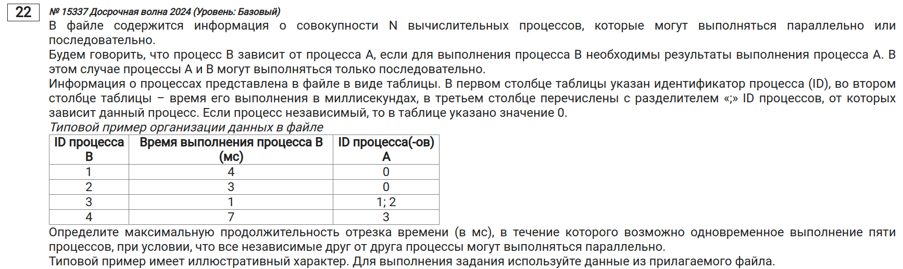

1) Делаем столбцы справа от данных чуть меньше, чтобы удобнее было заполнять их.

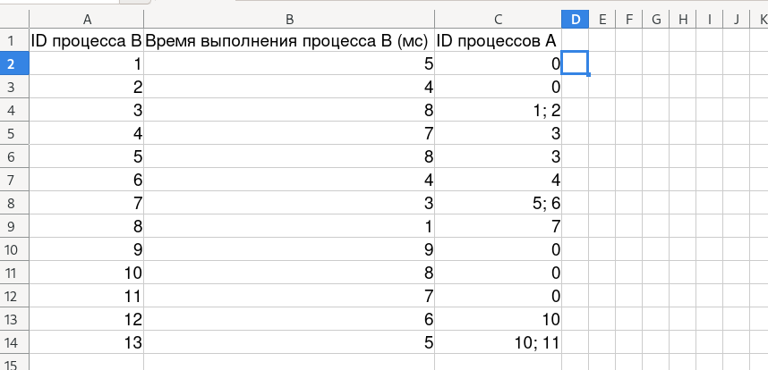{width=80%}

2) Занимаем для каждого ID процесса свои "места", т.е. заполняем измененные столбцы тем кол-вом единиц, которому равно время выполнения процесса. Например, первый процесс занимает 5 мс, значит, заполняем 5 ячеек единицами. А вот 3 процесс может начинаться после завершения первого или второго, следовательно, его единицы должны начинаться дальше оп горизонтали, чем у первого и второго. Заполняем следующим образом:

\center{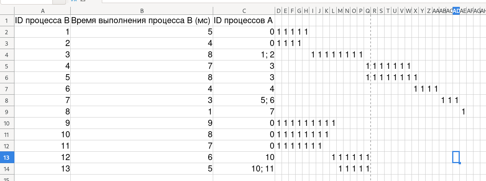{width=80%}}

3) Напишем формулу для подсчета кол-ва единиц в текущем столбце (у меня формулы на английском, у вас могут быть на русском):

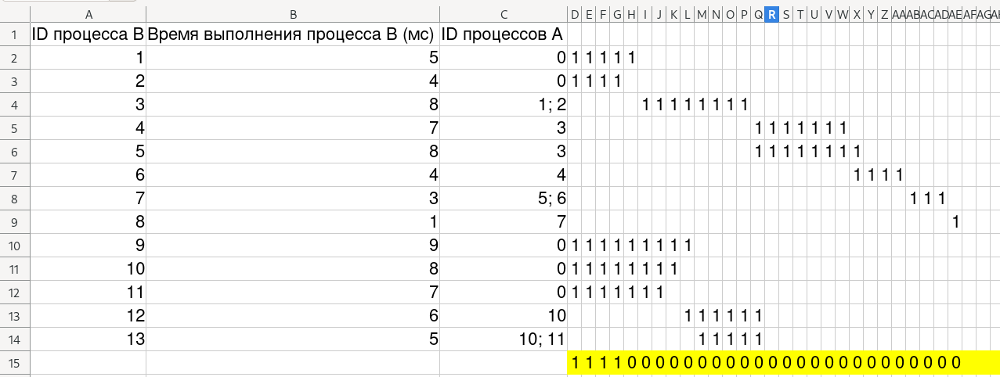{width=80%}

4) Может показаться, что работа сделана, но если немного подумать, то поймете, что ошиблись в ответе. Нам сказано найти НАИБОЛЬШУЮ продолжительность отрезка с одновременной работой 5 процессов.
- Вспомним \hyperref[1]{пункт 1}. Мы можем передвигать независимые процессы. Так давайте сделаем так с процессами 9, 10 и 11:

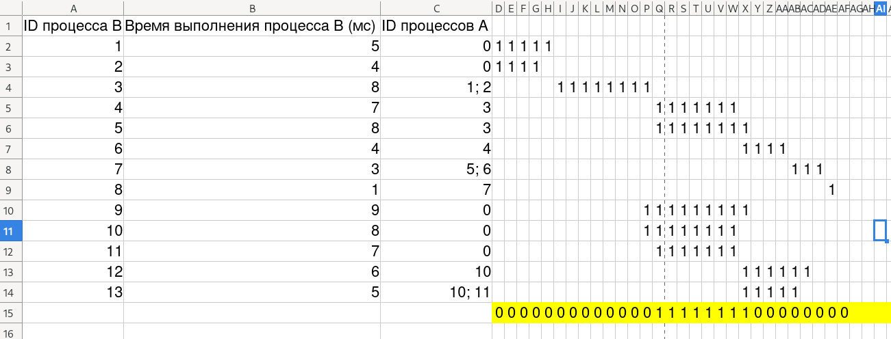{width=80%}

5) Так мы получим НАИБОЛЬШУЮ продолжительность: \boxed{8}

\section{Другое решение}

\chapter{Используем дерево}
\section{Ищем макс. продолжительность работы четырех процессов}

1) Нарисуем схему для независимых процессов (будем считать, что они зависимы от нулевого процесса):

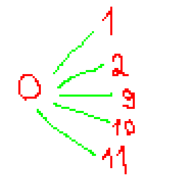{width=35%}

2) Далее нарисуем схемы зависимости остальных процессов:

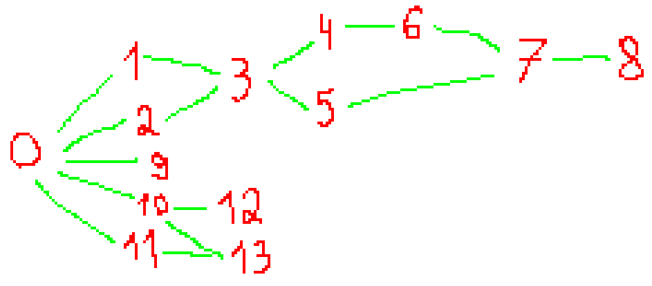{width=60%}

3) Подпишем радом с каждым процессом его длительность:

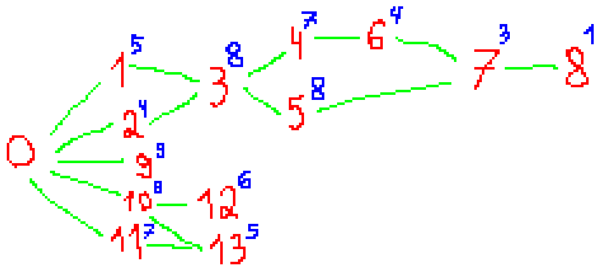{width=60%}

4) Суть заключается в том, что мы можем объединять последовательные процессы (например, процесс 4 и 6). Также мы можем находить общее кол-во времени у параллельных процессов.

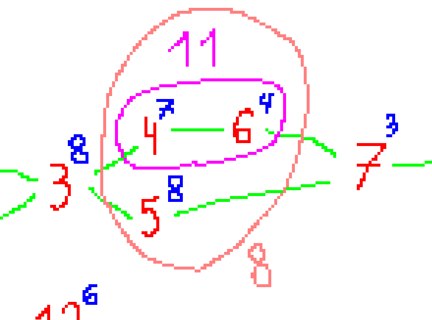{width=50%}

- Здесь мы объединяем процесс 4 и 6, в результате чего получаем (один новый) процесс длительностью 11 мс времени.
- Находим общее кол-во времени у получившегося процесса с 5-ым процессом. Это будет 8 мс. Причем считается, что задействовано только два процесса.
- Это можно легко понять, рассмотрев данные элементы в Excel, где удобная форма для понимания работы процессов.

5) Давайте найдем оптимальный выбор с помощью таких объединений и общих сумм:

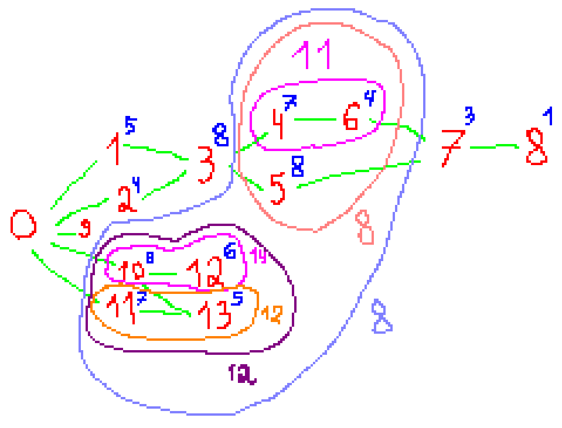{width=70%}

- Здесь мы объединили процессы 4 и 6 (будет процессом A), 10 и 12 (B), 11 и 13 (C).
- Далее нашли общую сумму для процессов A и 5, а также для процессов B и C. Мы смогли сделать такое "пересечение", т.к. процессы 10 и 11 независимы, следовательно, они могут передвигаться куда угодно (и их зависимые процессы вместе с ними).
- Нашли общее время у этих сумм и получили \boxed{8}

\section{Ищем макс. продолжительность работы четырех процессов (2)}

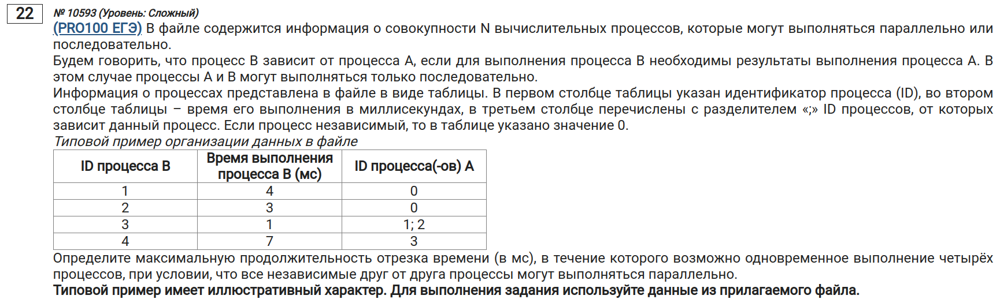

1) Составим схему зависимостей процессов:

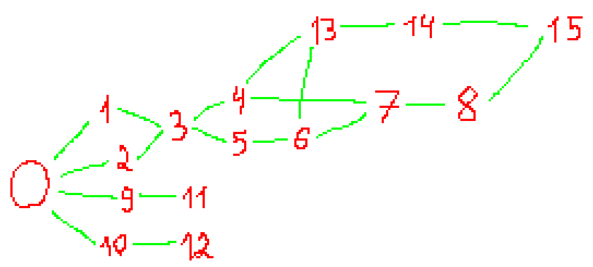{width=60%}

2) Напишем время выполнения для каждого:

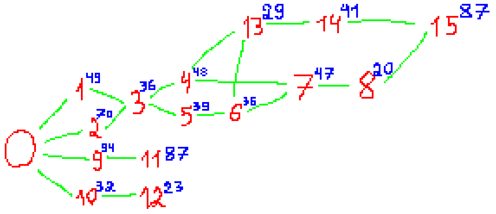{width=65%}

3) Найдем макс. продолжительность:

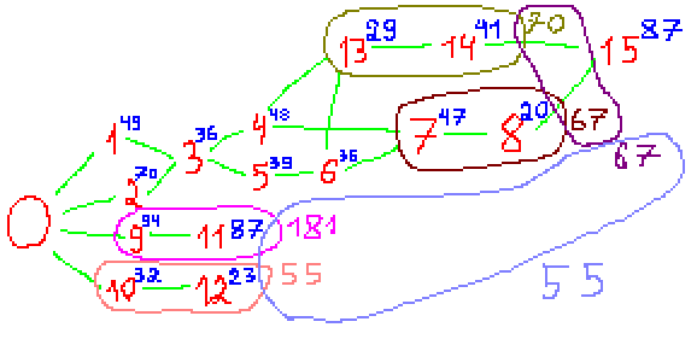{width=65%}

4) Получаем ответ: \boxed{55}

\chapter{Использование ВПР}
\section{Ищем мин. время работы всех процессов}

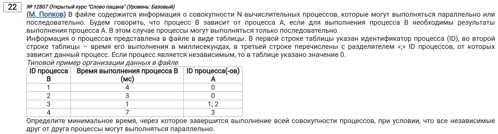

1) Разобъем зависимости на отдельные ячейки (в LibreOffice `Данные -> Текст по столбцам`):

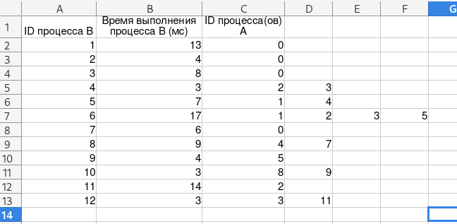{width=70%}

2) "Займем" справа то кол-во столбцов, которое равно макс. кол-ву зависимостей из каждого процесса (в нашем случае, столбцов добавится три):

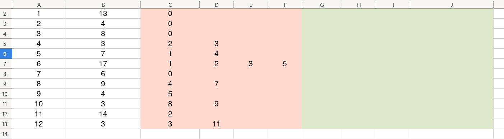{width=70%}

3) Удаляем заголовки для столбцов и вместо них ставим ноль в самую первую ячейку, а также ставим ноль в начало столбца, в котором будет время каждого процесса:y

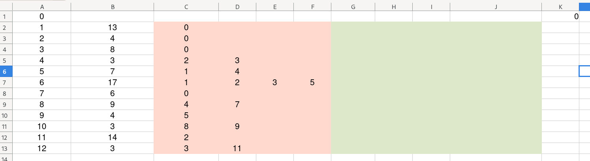{width=70%}

4) Запишем пока что неправильные значения времени для каждого процесса в тот столбец, куда мы поставили ноль. Причем к значению времени процесса будем суммировать значения (которых пока нет) времени его зависимостей:

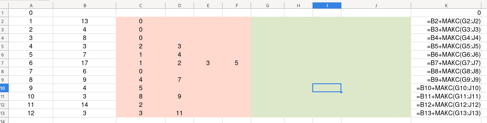{width=70%}

5) Теперь воспользуемся функцией ВПР со следующими аргументами:
    1. ID процесса-зависимости
    2. Таблица (у нас будет браться диапазон от A до K). Важно, чтобы эти буквы не менялись при "растяжении" формулы!
    3. Столбец с итоговым временем выполнения процесса
    4. Просто ставим ноль.

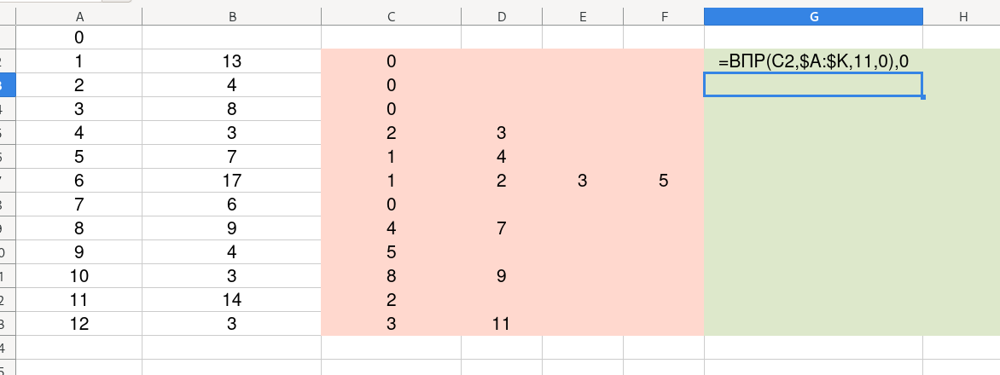{width=70%}

- Дальше "растяните" эту формулу для всех остальных ячеек.
- (*Для пользователей LibreOffice*) Если у вас вышла ошибка `#Н/Д` (при этом вы всё сделали правильно до этого пункта), напишите формулу `=ЕСЛИОШИБКА(наша формула ВПР;0)`.
- Получаем следующее:

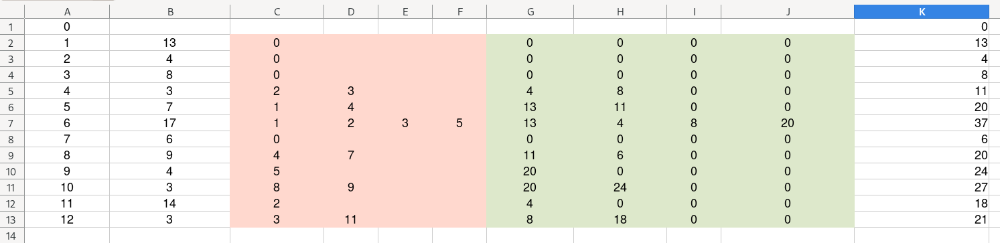{width=70%}

6) Находим макс. число из столбца с результатами времени работы каждого процесса и получаем ответ: \boxed{37}

\section{Советы}

- Если в задаче говорится о задержке для процесса `B`, который зависит от процесса `A`, (или что-то в этом роде), то к результату, где находится итоговое время работы процесса добавляем условие:
    - если текущий процесс независим, то берем время работы процесса, иначе плюсуем к нему еще задержку и макс/мин время работы процессов, от которых он зависим.
    - Например, время работы процесса находится в ячейке B2. Формула для него будет примерно следующей: `=ЕСЛИ(С2=0;B2;B2 + 3 + МИН/МАКС)`. Здесь `C2` - ячейка, в которой находится информация о зависимостях текущего процесса. Если он зависит от нулевого процесса, то данный процесс независим, иначе у него есть зависимости, в связи с чем нужно добавлять задержку.

- Если неизвестно время работы одного процесса, то ставим ноль, используем ВПР и постепенно увеличиваем время, пока итоговый ответ не подойдет под условие (например, итоговое время не должно быть больше 100 мс).

- Если же неизвестен процесс, то работа аналогично, как с неизвестным временем работы (т.е. просто подставляем ID процесса, пока не получим валидный ответ).

- Если нужно найти активные процессы, которые будут, например, активны на 200 мс, то нужно создать еще одну колонку, где будет начало работы процесса.
    - Одна колонка с началом работы процесса + 1. Начало работы мы можем найти после вычитания длительности работы и полной работы процеса. Причем это начало работы будет относительно всего времени работы процессов. Плюс один необходим, т.к. после данного вычитания мы получим время, после которого начнется работа самого процесса. Именно поэтому прибавляем один.
    - Одна колонка для времени работы процессов.
    - Далее с помощью формулы `ЕСЛИ` находим процессы, чье время работы либо заканчивается до, либо начинается до или с 200 мс. Т.е. `начало работы процесса <= 200 <= конец работы`.
