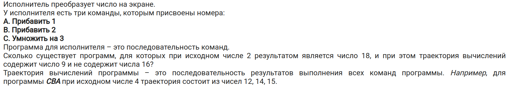
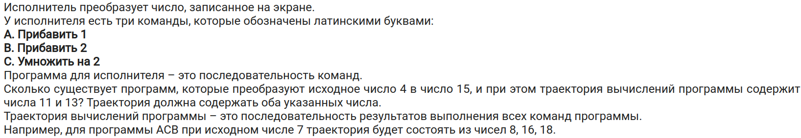
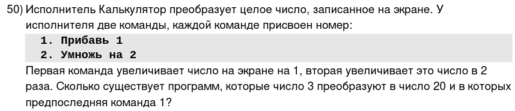
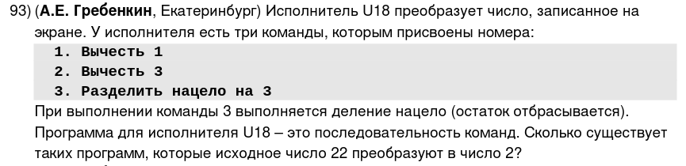
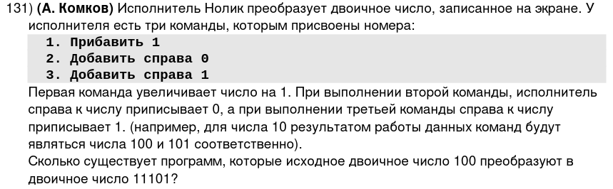
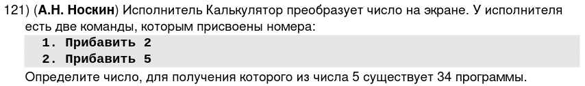
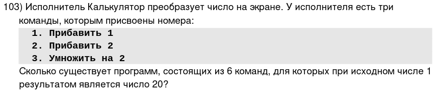
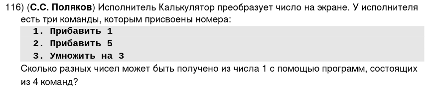
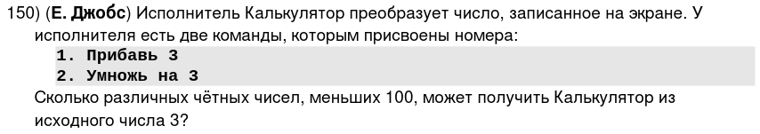

\tableofcontents
\newpage

\chapter{Введение для понимания}
\section{Задача \textnumero 1} \label{one}
Возьмем следующую задачку: "Даны две операции: прибавить $1$, умножить на $2$. Найдите кол-во путей, чтобы число $2$ превратить в $10$"

1) Составим следующую таблицу:

\begin{center}
\begin{tabular}{| c | c | c |}
\hline
\textnumero & $+1$ & $* 2$ \\
\hline
2 & & \\
3 & & \\
4 & & \\
5 & & \\
6 & & \\
7 & & \\
8 & & \\
9 & & \\
10 & & \\
\hline
\end{tabular}
\end{center}

2) Сделали нумерацию от 2 до 10, т.к. у нас есть $+1$.
3) Заполним таблицу в зависимости от текущего номера:

\begin{center}
\begin{tabular}{| c | c | c |}
\hline
\textnumero & $+1$ & $* 2$ \\
\hline
2 & 3 & 4\\
3 & 4 & 6\\
4 & 5 & 8\\
5 & 6 & 10 \\
6 & 7 & \\
7 & 8 & \\
8 & 9 & \\
9 & 10& \\
10 & & \\
\hline
\end{tabular}
\end{center}

4) Посчитаем кол-во путей для каждого номера, начиная с конца (с 10)

> **Замечание:** Будем считать, что в последнее число всегда можно попасть одним путем!

- Например, из десятки в десятику можно попасть одним путем десятку.
- Когда дошли до $\textnumero 5$, у нас встречается два пути: $6$ и $10$. В $6$ можно попасть только одним путем, в 10 тоже. Следовательно, в $5$ можно попасть двумя путями.
- В $4$ можем попасть из $5$ и $8$. В $5$ (как выяснили недавно) можно попасть двумя путями, а в $8$ - $1$ путем. Значит, в $4$ попадаем $2 + 1 = 3$ путями.

\begin{center}
\begin{tabular}{| c | c | c | c |}
\hline
\textnumero & $+1$ & $* 2$ & \\
\hline
2 & 3 & 4 & \textcolor{red}{4 + 3}\\
3 & 4 & 6 & \textcolor{red}{3 + 1}\\
4 & 5 & 8 & \textcolor{red}{2 + 1}\\
5 & 6 & 10 & \textcolor{red}{1 + 1}\\
6 & 7 & & \textcolor{red}{1}\\
7 & 8 & & \textcolor{red}{1}\\
8 & 9 & & \textcolor{red}{1}\\
9 & 10& & \textcolor{red}{1}\\
10 & & & \textcolor{red}{1}\\
\hline
\end{tabular}
\end{center}

5) Получаем ответ: $\boxed{7}$

\section{Задача \textnumero 2} \label{two}

Условие задачи: "Есть две операции: прибавит $1$, умножить на $2$. Сколько путей превратить число $2$ в $20$, проходя через $8$?"

1) Эту задачу нужно разбить на две подзадачи: посчитать кол-во путей до 8 и после 8 до 20.

\begin{center}
\fontsize{12pt}{12pt}\selectfont
\begin{tabular}{| c | c | c |}
\hline
\textnumero & $+1$ & $ * 2$ \\
\hline
2 & & \\ \hline
3 & & \\ \hline
4 & & \\ \hline
5 & & \\ \hline
6 & & \\ \hline
7 & & \\ \hline
8 & & \\ \hline
\end{tabular}
\quad
\begin{tabular}{| c | c | c |}
\hline
\textnumero & $+1$ & $ * 2$ \\
\hline
8 & & \\ \hline
9 & & \\ \hline
10 & & \\ \hline
11 & & \\ \hline
12 & & \\ \hline
13 & & \\ \hline
14 & & \\ \hline
15 & & \\ \hline
16 & & \\ \hline
17 & & \\ \hline
18 & & \\ \hline
19 & & \\ \hline
20 & & \\ \hline
\end{tabular}
\end{center}

2) Заполним две таблицы:

\begin{center}
\begin{tabular}{| c | c | c |}
\hline
\textnumero & $+1$ & $ * 2$ \\
\hline
2 & 3 & 4 \\ \hline
3 & 4 & 6\\ \hline
4 & 5 & 8 \\ \hline
5 & 6 & \\ \hline
6 & 7 & \\ \hline
7 & 8 & \\ \hline
8 & & \\ \hline
\end{tabular}
\quad
\begin{tabular}{| c | c | c |}
\hline
\textnumero & $+1$ & $ * 2$ \\
\hline
8 & 9 & 16\\ \hline
9 & 10 & 18\\ \hline
10 & 11 & 20 \\ \hline
11 & 12  & \\ \hline
12 & 13 & \\ \hline
13 & 14 & \\ \hline
14 & 15 & \\ \hline
15 & 16 & \\ \hline
16 & 17 & \\ \hline
17 & 18 & \\ \hline
18 & 19 & \\ \hline
19 & 20 & \\ \hline
20 &  & \\ \hline
\end{tabular}
\end{center}

3) Посчитаем кол-во путей для этих таблиц:

\begin{center}
\begin{tabular}{| c | c | c | c |}
\hline
\textnumero & $+1$ & $ * 2$ &  \\
\hline
2 & 3 & 4 & \textcolor{red}{3 + 2} \\ \hline
3 & 4 & 6 & \textcolor{red}{2 + 1} \\ \hline
4 & 5 & 8 & \textcolor{red}{1 + 1}\\ \hline
5 & 6 & & \textcolor{red}{1}\\ \hline
6 & 7 & & \textcolor{red}{1}\\ \hline
7 & 8 & & \textcolor{red}{1}\\ \hline
8& & & \textcolor{red}{1}\\ \hline
\end{tabular}
\quad
\begin{tabular}{| c | c | c | c |}
\hline
\textnumero & $+1$ & $ * 2$ & \\ \hline
8 & 9 & 16 & \textcolor{red}{3 + 1} \\ \hline
9 & 10 & 18 & \textcolor{red}{2 + 1}\\ \hline
10 & 11 & 20 & \textcolor{red}{1 + 1}\\ \hline
11 & 12 & & \textcolor{red}{1} \\ \hline
12 & 13 & & \textcolor{red}{1} \\ \hline
13 & 14 & & \textcolor{red}{1} \\ \hline
14 & 15 & & \textcolor{red}{1} \\ \hline
15 & 16 & & \textcolor{red}{1} \\ \hline
16 & 17 & & \textcolor{red}{1} \\ \hline
17 & 18 & & \textcolor{red}{1} \\ \hline
18 & 19 & & \textcolor{red}{1} \\ \hline
19 & 20 & & \textcolor{red}{1} \\ \hline
20 &  &  & \textcolor{red}{1}  \\ \hline
\end{tabular}
\end{center}

4) Для первой таблицы получается $5$ путей, а для второй - $4$.
5) Чтобы посчитать общее кол-во путей, нужно брать один путь из первой таблицы и проходить все $4$ пути из второй. Затем брать другой и делать то же самое. Таким образом, получим ответ: $5 \cdot 4 = \boxed{20}$

\chapter{Программное решение}
\section{Рекурсивный подсчет}

Рассмотрим решение для \hyperref[one]{первой задачи}.

1) Напишем функцию, принимающая два аргумента: текущее число и число, к которму мы должны прийти:
```python
def f(current, end):
```

2) Если текущее число больше того, что нам надо, то возвращаем ноль, т.к. мы к самому желательному ответу так и не пришли:
```python
    if current > end:
        return 0
```
- Если в задаче сказано, что операции не должны проходить через какое-то число, то при достижении `current` этого числа, мы должны возвращать ноль:

```python
    if current > end or current == 4:
        return 0
```

3) Если же текущее число равно конечному, то это подходит за один путь:
```python
    if current == end:
        return 1
```

4) Остается обработать текущее число, которое меньше конечного ответа:
```python
    if current < end:
        return f(current + 1, end) + f(current * 2, end)
```

- Здесь складываются результаты вызовов функций для разных операций с текущим числом.
    - Например, если текущее число 4, а из операций у нас прибавление единицы и умножение на 2, то делаем два вызова этой функции (что порождает рекурсию).

- Если в задаче другие операции, то нужно поменять их здесь.

5) Чтобы получить ответ, просто делаем вывод данной функции с числами, указанными в задаче:
```python
print(f(2, 10))
```
- Если же в задаче сказано, что мы должны проходить через какое-то число (как это было во \hyperref[two]{второй задаче}), то просто делаем два вызова, результаты которых затем умножаем: \label{mult}
```python
print(f(2, 8) * f(8, 20))
```

\section{Динамическое решение}

Рассмотрим на примере \hyperref[one]{первой задачи}

1) Создадим список, в котором будут храниться кол-во путей к конкретному числу:
```python
ways = [0] * 20
```

2) Заполним "клетку" с начальным числом в один путь (т.к. будем идти от этого числа):
```python
ways[2] = 1
```

3) Напишем цикл. В ходе его выполнения будем добавлять кол-во путей текущего индекса к тем числам (индексам), к которым мы можем прийти благодаря операциям из условия задачи (т.е. если сказано, что можно прибавить 1 к числу, то прибавляем к индексации 1):
```python
for ind in range(2, 10):
    if (ind + 1) <= 10:
        ways[ind + 1] += ways[ind]
    if (ind * 2) <= 10:
        ways[ind * 2] += ways[ind]
```

4) Выведем значение 10-го индекса (числа) списка:
```python
print(ways[10])
```

---

Рассмотрим решение для \hyperref[two]{второй задачи}
```python
ways = [0] * 50
ways[2] = 1

for ind in range(2, 8):
    if (ind + 1) <= 8:
        ways[ind + 1] += ways[ind]
    if (ind * 2) <= 8:
        ways[ind * 2] += ways[ind]

for ind in range(8, 20);
    if (ind + 1) <= 20:
        ways[ind + 1] += ways[ind]
    if (ind * 2) <= 20:
        ways[ind * 2] += ways[ind]

print(ways[20])
```

- Заметим, что нам не пришлось умножать какие-то пути, как это было с \hyperref[mult]{рекурсивными способом}.
- Связано это с тем, что у нас здесь общий список. Как только у нас закончился первый цикл, второй начинается с уже имеющимися данными кол-ва путей для числа 8.

\newpage
\section{Обычная задача (\textnumero 6387 kompege.ru)}



1) Напишем функцию:
```{python}
def f(cur, end):
    if cur > end or cur == 16:
        return 0
    if cur == end:
        return 1
    if cur < end:
        return f(cur + 1, end) + f(cur + 2, end) + f(cur * 3, end)
```

- Мы отметили те случаи, когда текущее число равно 16. В этом случае возвращаем 0 путей.

2) Напишем вывод:
```python
print(f(2, 9) * f(9, 18))
```

- Сделали два вызова, чтобы число 9 обязательно входило в числе путей.

**Итоговый код:**
```{python}
def f(cur, end):
    if cur > end or cur == 16:
        return 0
    if cur == end:
        return 1
    if cur < end:
        return f(cur + 1, end) + f(cur + 2, end) + f(cur * 3, end)


print(f(2, 9) * f(9, 18))
```

\section{Два входящих числа (\textnumero 16332 kompege.ru)}


1) Напишем функцию:
```python
def f(cur, end):
    if cur == end:
        return 1
    if cur > end:
        return 0
    if cur < end:
        return f(cur + 1, end) + f(cur + 2, end) + f(cur * 2, end)
```

2) Т.к. тут входит два числа, то сначала нужно дойти до первого, затем от первого до второго, а потом от второго до конечного (логика та же, что и во \hyperref[two]{второй задаче}):
```python
print(f(4, 11) * f(11, 13) * f(13, 15))
```

**Итоговый код:**
```{python}
def f(cur, end):
    if cur == end:
        return 1
    if cur > end:
        return 0
    if cur < end:
        return f(cur + 1, end) + f(cur + 2, end) + f(cur * 2, end)


print(f(4, 11) * f(11, 13) * f(13, 15))
```

\section{Предпоследняя операция (\textnumero 50 Поляков)}


Можно легко сделать эту задачу аналитически[^1], но мы попробуем следующий способ: будем сохранять операции для текущего пути в кортеж.

1) Напишем функцию:
```python
def f(cur, end, opers):
    if cur > end:
        return 0
    if cur == end:
        return 1 if opers[-2] == 1 else 0
    if cur < end:
        return f(cur + 1, end, opers + (1,)) \
            + f(cur * 2, end, opers + (2,))
```

- Здесь мы добавляем в аргументы кортеж `opers`, в котором будут хранится операции для данного пути. Если мы делаем прибавление 1, то добавляем в кортеж 1 (как номер операции). Аналогично для второй операции.
- Когда текущее число стало равно конечному, мы смотрим, является предпоследнее значение кортежа нужной нам операцией.

2) Напишем вывод:
```python
print(f(3, 20, tuple()))
```

**Итоговый код:**
```{python}
def f(cur, end, opers):
    if cur > end:
        return 0
    if cur == end:
        return 1 if opers[-2] == 1 else 0
    if cur < end:
        return f(cur + 1, end, opers + (1,)) \
            + f(cur * 2, end, opers + (2,))


print(f(3, 20, tuple()))
```

[^1]: Похожую задачу разбирал аналитически Алексей Кабанов на [своем стриме](https://youtu.be/7WPN3t6vCSs?t=4085).

\section{Обратный счет (\textnumero 93 Поляков)}


- Наш код немного поменяется.

- Можно, конечно, переделать задачу так, чтобы все было, как обычно.

- Чтобы не путаться с предыдущим решением, поменяю названия аргументов на `big` и `small`.

1) Напишем функцию:
```python
def f(big, small):
    if big < small:
        return 0
    if big == small:
        return 1
    if big > small:
        return f(big - 1, small) + f(big - 3, small) + f(big // 3, small)
```

- Здесь мы далем ту же проверку, как и в предыдущих задачах, только поменяв знаки. Именно поэтому я выбрал такое название для параметров, чтобы легче было сопоставить с предыдущим задачами.

2) Выведем результат:
```python
print(f(22, 2))
```

**Итоговый код:**
```{python}
def f(big, small):
    if big < small:
        return 0
    if big == small:
        return 1
    if big > small:
        return f(big - 1, small) + f(big - 3, small) + f(big // 3, small)


print(f(22, 2))
```

\section{Двоичная запись (\textnumero 131 Поляков)}


Будем хранить двоичную запись в десятичном виде.

1) Напишем функцию:
```python
def func(cur: int, end: int):
    if cur > end:
        return 0
    if cur == end:
        return 1
    if cur < end:
        return func(int(f'{cur:b}0', 2), end) \
            + func(int(f'{cur:b}1', 2), end) \
            + func(cur + 1, end)
```

- Сравниваем числа в условиях, как обычно. Именно поэтому удобно хранить числа в десятичной записи.
- Перед вызовом функции мы переводим число в двоичную запись, добавляем новую цифру, а затем конвертируем в десятичную запись.
- [Сигнатуры параметров](https://peps.python.org/pep-0484/) указана для понимания.

2) Сделаем вывод:
```python
print(func(int('111', 2), int('11101', 2)))
```

- Не забываем перевести двоичную запись в десятичную, чтобы было удобно работать.

**Итоговый код:**

```{python}
def func(cur, end):
    if cur > end:
        return 0
    if cur == end:
        return 1
    if cur < end:
        return func(int(f'{cur:b}0', 2), end) \
            + func(int(f'{cur:b}1', 2), end) \
            + func(cur + 1, end)


print(func(int('100', 2), int('11101', 2)))
```

\section{Ищем конечное число с определенным кол-вом путей (\textnumero 121 Поляков)}


Под "программы" подразумевается кол-во путей.

1) Напишем функцию:
```python
def f(cur, end):
    if cur > end:
        return 0
    if cur == end:
        return 1
    if cur < end:
        return f(cur + 2, end) + f(cur + 5, end)
```

2) Пройдемся по числам от 6 до, например, 100 и узнаем, в каком из них кол-во путей будет равно 34:
```python
for end in range(6, 100):
    if func(5, end) == 34:
        print(end)
        break
```

**Итоговый код:**
```{python}
def f(cur, end):
    if cur > end:
        return 0
    if cur == end:
        return 1
    if cur < end:
        return f(cur + 2, end) + f(cur + 5, end)


for end in range(6, 100):
    if func(5, end) == 34:
        print(end)
        break
```

\section{Ищем кол-во путей с определенным кол-вом операций}


Добавим параметр, который будет служить счетчиком операций.

1) Напишем функцию:
```python
def f(cur, end, opers):
    if cur > end:
        return 0
    if cur == end:
        return 1 if opers == 6 else 0
    if cur < end:
        return f(cur + 1, end, opers + 1) \
            + f(cur + 2, end, opers + 1) \
            + f(cur * 2, end, opers + 1)
```

- При достижении текущим числом конечного значения мы смотрим, равно ли кол-во пераций 6 или нет. Если да, то этот путь мы считаем, иначе считаем его за ноль.

2) Сделаем вывод:
```python
print(f(1, 20, 0))
```

**Итоговый код:**
```{python}
def f(cur, end, opers):
    if cur > end:
        return 0
    if cur == end:
        return 1 if opers == 6 else 0
    if cur < end:
        return f(cur + 1, end, opers + 1) \
            + f(cur + 2, end, opers + 1) \
            + f(cur * 2, end, opers + 1)


print(f(1, 20, 0))
```

\section{Ищем кол-во чисел, которые могут получиться с определенным кол-вом операций (\textnumero 116 Поляков)}
 \label{set}

1) Заведем глобальное множество, в который будем складывать все валидные числа.
```python
valids = set()
```

- Используем множество, потому что нам нужны только уникальные числа.

2) Напишем функциюл:
```python
def f(cur, opers):
    if opers == 4:
        valids.add(cur)
    else:
        f(cur + 1, opers + 1), f(cur + 5, opers + 1), f(cur * 3, opers + 1)
```

- Здесь мы ничего не возвращаем, потому что это нам не нужно, ведь все важные данные добавляются в множество.

3) Сделаем вывод:
```python
f(1, 0)
print(len(valids))
```

**Итоговый код:**
```{python}
valids = set()


def f(cur, opers):
    if opers == 4:
        valids.add(cur)
    else:
        f(cur + 1, opers + 1), f(cur + 5, opers + 1), f(cur * 3, opers + 1)


f(1, 0)
print(len(valids))
```

\section{Интересная задачка от Джобса (\textnumero 150 Поляков)}


- Это можно сделать аналитически:
    - У нас две операции: прибавить 3 либо умножить на него. Учитывая, что мы начинаем с трех, всегда будет получаться число, кратное 3.
    - Все, что нам остается, -- найти числа, кратные трём и двум и лежащие на отрезке от 3 до 100.
```{python}
k = 0
for i in range(3, 100):
    if i % 3 == 0 and i % 2 == 0:
        k +=1

print(k)
```
