\tableofcontents
\newpage

\chapter{Решение задач}
\section{\textnumero 16388 kompege.ru}
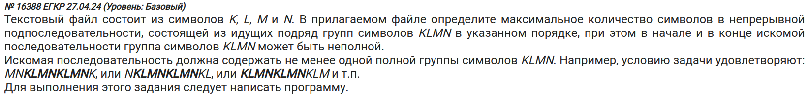
1) Откроем файл и прочитаем данные:
```python
file = file.readline()
data = file.readline()
file.close()
```

2) Составим регулярку:
```python
import re


pattern = r'(?=((N|MN|LMN|KLMN|)(KLMN)+(K|KL|KLM|KLMN|)))'
```

- Разберем по частям:
    - Запись `(N|MN|LMN|KLMN|)` означает "последовательность может начинаться либо с неполного набора строки KLMN (т.е. либо N, либо MN и т.д.), либо с какой-нибудь другой буквой (причем эта буква будет считаться за ничто). Под "ничто" подразумевается пустой символ после `KLMN|`.
    - Запись `(KLMN)+` означает "множественное повторение строки KLMN".
    - Запись `(K|KL|KLM|KLMN|)` аналогична первой.
    - Все это объединяется с помощью круглых скобок и засовывается в *positive lookahead*. Метод `findall` не может по умолчанию искать совпадения, которые будут "заходить" друг на друга. Именно поэтому используется positive lookahead -- `(?=(...))`.

3) Ищем совпадения и выводим нужные данные:
```python
matches = re.findall(pattern, data)

ans = sorted([i for match in matches for i in match], key=len)[-1]
print(ans)
print(len(ans))
```

- В переменной `matches` находятся группы (наши positive lookahead), в которых находятся подгруппы (неполные KLMN, подряд идущие KLMN). Нам нужна только та строка, имеющая максимальную длину. Поэтому мы считываем все эти подгруппы в единый список, сортируем его и выводим последний элемент.
- Для большей наглядности выведем саму подгруппу.

**Итоговый код:**
```python
import re


file = open('24_16388.txt', encoding='utf-8')
data = file.readline()
pattern = r'(?=((|N|MN|LMN|KLMN)(KLMN)+(K|KL|KLM|KLMN|)))'
matches = re.findall(pattern, data)

ans = sorted([i for match in matches for i in match], key=len)[-1]
print(ans)
print(len(ans))

file.close()
```

- Ответ: $\boxed{182}$

\section{\textnumero 1633 kompege.ru}
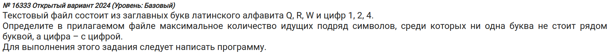

**Итоговый код:**
```python
import re

file = open('24_16333.txt', encoding='utf-8')
data = file.readline()

pattern = r'(?=((Q[124]|R[124]|W[124]|1[QRW]|2[QRW]|4[QRW])+))'
matches = re.findall(pattern, data)

groups = [i for match in matches for i in match]

forbidden_symbols = ['QQ', 'QR', 'QW', 'RR', 'WW', 'RW', '11', '12',
                     '14', '24', '22', '44']
valid_groups = []
for group in groups:
    check_all_symbols = [True if (symbol not in group) and \
        (symbol[::-1] not in group) else False \
        for symbol in forbidden_symbols]
    if all(check_all_symbols):
        valid_groups.append(group)

ans = sorted(valid_groups, key=len)[-1]
ans_len = len(ans)

start_ind = data.index(ans)
end_ind = start_ind + ans_len

if ((data[start_ind] in '124') and (data[start_ind-1] in 'QRW')) or \
    ((data[start_ind] in 'QRW') and (data[start_ind-1] in '124')):
    ans_len += 1
    start_ind -= 1

if ((data[end_ind+1] in '124') and (data[end_ind] in 'QRW')) or \
    ((data[end_ind+1] in 'QRW') and (data[end_ind] in '124')):
    ans_len +=1
    end_ind +=1

print(ans_len)
print(data[start_ind:end_ind])

file.close()
```

- Более короткий вариант:
```python
import re

file = open('24_15339.txt', encoding='utf-8')
data = file.readline()

data = data.replace('A', 'Z').replace('B', 'Z').replace('C', 'Z')
data = data.replace('6', '1').replace('7', '1').replace('8', '1')
data = data.replace('9', '1')

pattern = r'(?=((Z1|1Z)+))'
matches = re.findall(pattern, data)

ans = sorted([i for match in matches \
    for i in match \
    if ('ZZ' not in i) and ('11' not in i)], key=len)[-1]
print(ans)
print(len(ans))

file.close()
```

- Здесь мы делаем замену всех букв на какую-то одну, а всех цифр - на другую.
- Затем проверяем эти "обобщающие" символы с помощью регулярки.
- Проходя через подгруппы, мы смотрим, чтобы не было рядом стоящих "обобщающих" символов.
- Выводим максимальный по длине результат.

\section{\textnumero 14704 kompege.ru}
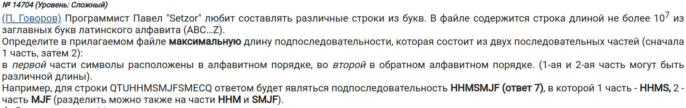
```python
import string
import re

file = open('24_14704.txt', encoding='utf-8')
data = file.readline()

alphabet = string.ascii_uppercase
alphabet_with_div = '*'.join(list(alphabet))
reversed_alphabet_with_div = '*'.join(list(alphabet[::-1]))

in_alphabet = rf'{alphabet_with_div}'
in_reversed_alphabet = rf'{reversed_alphabet_with_div}*'
pattern = rf'(?=({in_alphabet}{in_reversed_alphabet}))'
matches = re.findall(pattern, data)

ans = sorted([group for group in matches], key=len)[-1]
print(ans)
print(len(ans))

file.close()
```

- Добавил к `in_reversed_alphabet` звездочку, т.к. Последним символом из `reversed_alphabet_with_div` будет символ `A`, который тоже может повторяться несколько раз.

\section{\textnumero 14647 kompege.ru}
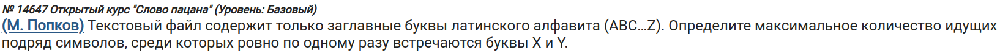
```python
import string
import re

file = open('cdegb1HpP.txt', encoding='utf-8')
data = file.readline()

pattern = r'(?=(([A-WZ]*X[A-WZ]*Y[A-WZ]*|[A-WZ]*Y[A-WZ]*X[A-WZ]*)))'

matches = re.findall(pattern, data)
valid_groups = [group for groups in matches for group in groups]

ans = sorted(valid_groups, key=len)[-1]
print(ans)
print(len(ans))
file.close()
```

- Здесь мы рассматриваем два случая, которые разделены `|`:
    1) `[A-WZ]*X[A-WZ]*Y[A-WZ]*` - сначала идет `X`, а затем `Y`, причем до, между и после них либо может стоять какое-то кол-во других букв, либо нет (помогает символ `*`).
    2) `[A-WZ]*Y[A-WZ]*X[A-WZ]*` - аналогично предыдущему, только теперь сначала идет `Y`, а затем `X`.

\section{\textnumero 14646 kompege.ru}
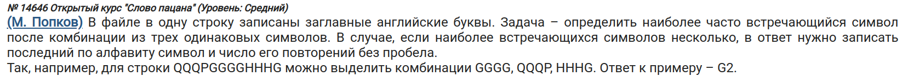
```python
import string
import re

file = open('oF6qYP-xT.txt', encoding='utf-8')
data = file.readline()

pattern = r'(?=(%s{3}(.)))'

dct = dict()
alphabet = string.ascii_uppercase
for letter in alphabet:
    result_pattern = pattern % (letter)
    matches = re.findall(result_pattern, data)

    for groups in matches:
        all_word, symbol = groups
        if symbol not in dct:
            dct[symbol] = 0

        if symbol:
            dct[symbol] += 1

print(sorted(dct.items(), key=lambda x: x[1]))
file.close()
```

- Необходимо, чтобы перед символом шли три одинаковых буквы. Именно поэтому такая простая регулярка.
- В цикле `for groups in matches` делается проверка, что `symbol` вообще есть.

\section{\textnumero 2420 kompege.ru}
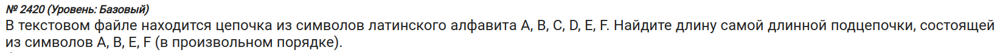
```python
import re

file = open('NneIhILSl.txt', encoding='utf-8')
data = file.readline()

pattern = r'(?=([ABEF]+))'
matches = re.findall(pattern, data)

ans = sorted([group for group in matches], key=len)[-1]
print(ans)
print(len(ans))

file.close()
```

\section{\textnumero 10724 kompege.ru}
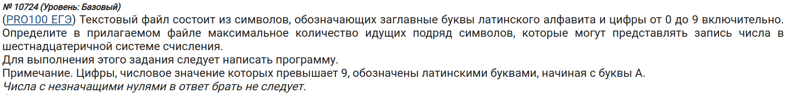
```python
import re

file = open('KjQITJOP6.txt', encoding='utf-8')
data = file.readline()

pattern = r'(?=([0123456789ABCDEF]+))'
matches = re.findall(pattern, data)
ans = sorted([group.strip('0') for group in matches], key=len)[-1]
print(ans)
print(len(ans))

file.close()
```
- Форматируем найденную группу от впереди идущих нулей.

\section{\textnumero 5223 kompege.ru}
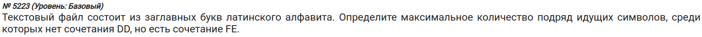
```python
import re

file = open('-Sq5f8X0N.txt', encoding='utf-8')
data = file.readline()

pattern = r'(?=((?:(?!DD)[A-Z])*(FE)(?:(?!DD)[A-Z])*D?))'
matches = re.findall(pattern, data)
ans = sorted([group for groups in matches for group in groups],
             key=len)[-1]
print(ans)
print(len(ans))
# print(data[data.index(ans)-2:data.index(ans)+len(ans)+2])

file.close()
```

- Конструкция `(?!...)` делает `...` как исключение. Т.е. если надо, чтобы слова не было, то используем эту конструкцию (в миксе с `(?:...)`.
- Конструкция `(?:...)` является *неотслеживаемой группой*, т.е. эта группа не будет стоять отдельно при вызове метода `.groups()`. Вообще, удобная штука для обособления части символов.

- Важно: в конце может стоять `D`, после которой будет идти `D`, но первую `D` надо взять в счет. Именно поэтому мы добавили ее в конце регулярки. Если убрать ее, то ответом будет та же строка, но на одну длину меньше по причине, описанной в начале пункта.

- Другой способ:
```python
file = open('-Sq5f8X0N.txt', encoding='utf-8')
data = file.readline()

valid_data = [s for s in data.replace('DD', 'D D').split() if 'FE' in s]
print(len(sorted(valid_data, key=len)[-1]))

file.close()
```
- Здесь мы разбиваем `DD` пробелом, чтобы могли посчитать отдельные строки, в которых нет двух `D`.

\section{\textnumero 12476 kompege.ru}
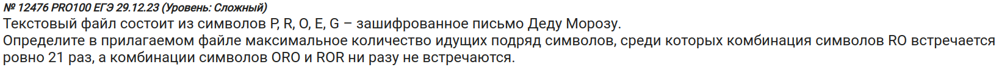

```python
import re

file = open('uleRzVuPF.txt', encoding='utf-8')
data = file.readline()

pattern = r'(?=((?:(?!ORO)(?!ROR)[A-Z])+))'
matches = re.findall(pattern, data)

ans = sorted((group for group in matches \
    if group.count('RO') == 21), key=len)[-1]
max_len = len(ans)

start_ind = data.index(ans)
end_ind = start_ind + max_len

if (data[end_ind-1:end_ind+1] != 'RO' and \
    data[end_ind+1:end_ind+3] == 'RO') or \
    (data[end_ind-1:end_ind+1] != 'OR' and \
        data[end_ind+1:end_ind+3] == 'OR'):
    max_len += 1

print(ans)
print(max_len)

file.close()
```

- Делаем фильтрация, чтобы не забыть посчитать какую-то часть от `ROR` или `ORO` после найденной строки.

\section{\textnumero 7272 kompege.ru}
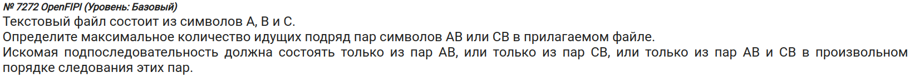

- Нам нужно найти кол-во пар, а не длину получившейся строки. Пара состоит из двух символов, поэтому ее длину будем делить на два.
```python
import re

file = open('QLNAobQmz.txt', encoding='utf-8')
data = file.readline()

pattern = r'(?=((AB|CB)*))'
matches = re.findall(pattern, data)

ans = sorted((group for groups in matches for group in groups), key=len)[-1]
print(ans)
print(len(ans) / 2)

file.close()
```

- Другое решение:
```python
file = open('QLNAobQmz.txt', encoding='utf-8')
data = file.readline()

data = data.replace('AB', '-').replace('CB', '-')
data = data.replace('A', ' ').replace('B', ' ').replace('C', ' ')
print(len(sorted((s for s in data.split()), key=len)[-1]))

file.close()
```

\section{\textnumero 6798 kompege.ru}
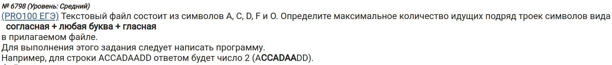

- Т.к. тут тройки, то нужно длину найденной строки разделить на 3.
```python
import re

file = open('A0SaX43YT.txt', encoding='utf-8')
data = file.readline()

pattern = r'(?=(([CDF].[AO])+))'
matches = re.findall(pattern, data)

ans = sorted((group for groups in matches for group in groups),
             key=len)[-1]
print(ans)
print(len(ans) / 6)

file.close()
```

\section{\textnumero 13715 kompege.ru}
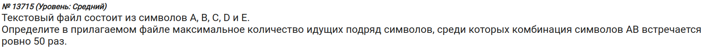
```python
import re

file = open('BPn7T1BoJ.txt', encoding='utf-8')
data = file.readline()

pattern = r'(?=(B?([^AB]*AB){50}[^AB]*A?))'
matches = re.findall(pattern, data)

ans = sorted((group for groups in matches for group in groups),
             key=len)[-1]
print(len(ans))

file.close()
```

- `[^AB]*` значит "ищи все кроме этой пары символов". Так можно удобно исключать слова, при этом чтобы искались все остальные символы.

\section{\textnumero 863 kompege.ru}
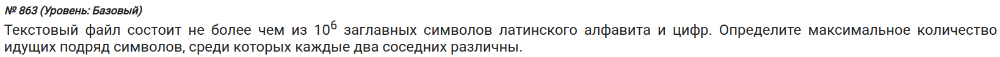

- Запись `(?:(.)\1)+` разберем подробно:
    - `(?:...)` означает "незахватываемая группа"
    - `\1` - ссылка (*backreference*) на первую (поэтому `1`) группу. В данном случае первой группой будет `(.)`.
- Если хочется проверить, чтобы следующий символ после текущего был другой, можно сделать следующее: `(?:(.)(?!\1))`, где `(?!\1)` означает "не равно первой группе".

\chapter{Полезное}
- [Про `lookahead`, `lookbehind` и т.д.](https://learn.javascript.ru/regexp-lookahead-lookbehind)
- [Хорошая статья про `lookbehind` и `backreference`](https://stackoverflow.com/questions/36047988/why-does-this-backreference-not-work-inside-a-lookbehind)
