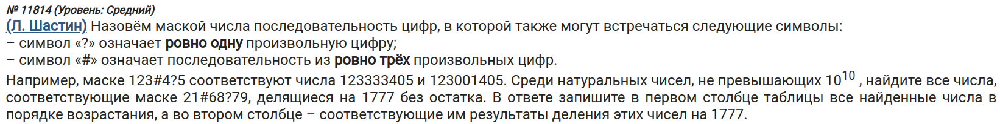

\tableofcontents
\newpage

\chapter{База про регулярки}

- *Регулярные выражения* (регулярки) - набор символов, помогающий найти информацию в тексте. Проще сказать, шаблоны.
- Например, если вам надо найти все файлы с расширением `png`, то вы, скорее всего, введет `*.png`. Это и есть регулярное выражение.
- Синтакис регулярных выражений везде может быть разным: в Python, в Java, на Windows и т.д.
- Ну а теперь к базовому синтаксису регулярок:
    - `.` (символ точки) -- любой символ. Буквально любой. Это может быть число, буква, иероглиф и т.д.
    - `\d` -- цифра (одна!).
    - `\w` -- буква (тоже одна!).
    - `+` -- 1 или большее число чего-то. Например, запись `\d+` означает "одна цифра или более".
    - `*` -- 0 или большее число чего-то. Аналогично с предыдущим, только теперь есть и нулевое кол-во.
    - `?` -- 0 или 1. Например, запись `\w?` означает "символ есть или нет".
    - `{n}` -- `n`-количество чего-то. Например, запись `\d{3}` означает "три подряд идущих цифры".
    - `{n,m}` -- длина строки от `n` до `m` (включительно!). Например, запись `\d{3,5}` означает "строка длиной от 3 до 5".
    - `{n,}` -- длина строки от `n` до бесконечности (специфичный символ `+`, так сказать). Например, запись `\w{4,}` означает "строка длиной 4 и более".
    - `[abc]` -- выбор одного из символов, указанных внутри квадратных скобок (в данном случае из символов `abc`). Можно комбинировать со знаками длины (`+*?`). Например, запись `[345]+` означает "одно или более кол-во символов, заключенных в квадртаных скобках". \label{square}
    - `[a-z]` -- весь английский алфавит в малом регистре.
    - `[A-Z]` -- в верхнем регистре.
    - `^` -- символ начало строки. Например, запись `^abc` означает "строка должна начинаться с символов abc".
    - `$` -- символ конца строки. Аналогично с предыдущим символом.
    - `(abc)`  -- группа символов (в данном случае символов `abc`). Бывает такое, что у вас есть шаблон, но из этого шаблона нужно вытащить какую-то часть. Именно для этого и существует группа. Например, запись `\w{5}(\d\d)` означает "дай мне две цифры, идущие после 5 букв". \label{group}

\chapter{Регулярки в Python}

- Для работы с регулярными выражениями в Python используется [модуль `re`](https://docs.python.org/3/library/re.html#module-re).
- [Функция `re.search`](https://docs.python.org/3/library/re.html#re.search) помогает найти совпадение шаблона (паттерна) с данными. Первый аргумент - само регулярное выражение, второй - данные в виде строки.
    - Например, вызов `re.search('\d\d', '123')` вернет объект класса `re.Match`. Это означает, что совпадение было найдено. Если же совпадений нет, то вызов функции вернет `None`.
- Есть [функция `re.findall`](https://docs.python.org/3/library/re.html#re.findall), имеющая те же аргументы, но отличающаяся по работе. Она ищет ВСЕ *непересекающиеся* совпадения, а не одно (как это делает `re.search`).
    - Например, вызов `re.findall('\d\d', '123')` вернет список с элементом `12`. Заметьте: в списке только одна пара из двух цифр, а не две (т.е. не `['12', '23']`). Как было сказано в определении, эта функция ищет НЕПЕРЕСЕКАЮЩИЕСЯ совпадения (т.е. совпадение не может заходить в границы другого совпадения).

\section{re против fnmatch}

- Главное отличие [`fnmatch`](https://docs.python.org/3/library/fnmatch.html) от `re` в том, что первый имеет скудный синтаксис.
- Вообще, `fnmatch` используется для обработки названий файлов и т.п.
- Из синтаксиса здесь только `?*[]` (ну и `![]`, что означает "совпадение с любым символом, кроме того, что находится внутри квадратных скобок").
- Немного про синтаксис `fnmatch`:
    - `?` -- любой ОДИН символ.
    - `*` -- ноль или более символов.
    - `[abc]` -- один из символов, заключенных в квадратные скобки (в данном случае символов `abc`).
    - `![abc]` -- обратная работа предыдущего синтаксиса.
- Бывают задачки, где нужно найти такое число, в котором, например, от 3 до 5 символов `9` или что-то в этом роде. Тогда `fnmatch` мало чем поможет.
- На больших объемах данных `fnmatch` будет работать медленее `re`, т.к. (если посмотреть [исходный код](https://github.com/python/cpython/blob/3.12/Lib/fnmatch.py)) эта функция внутри себя вызывает другие функции, связанные с системой (в частности, методы из модуля `os`).
- Исходя из всех вышеизложенных заключений, я выбираю `re`.
- Конечно, в базовых задачах будет хватать `fnmatch`. Но знание синтаксиса регулярок пригодится в будущем!

\chapter{Основная теорема арифметики}

- *Основная теорема арифметики* имеет следующее определение: "*Любое натуральное число, большее 1, либо является простым, либо может быть представлено в виде произведения простых чисел*".
- Например, число 100 можно расписать следующим образом: $2 \cdot 50 = 2 \cdot 2 \cdot 25 = 2 \cdot 2 \cdot 5 \cdot 5$. Как видим, мы пришли к тому, что число 100 можно разложить на произведение простых чисел.

\chapter{Число делителей} \label{divs}

- Пусть $$n = p_1^{a_1} \cdot p_2^{a_2} \cdot ... \cdot p_s^{a_s},$$ где $n$ - натуральное число $>1$, $a_i > 0$, а $p_i$ -- простое число.
- Тогда запись $(a_1 + 1) \cdot (a_2 + 1) \cdot ... \cdot (a_s + 1)$ будет являться числом делителей для числа $n$.
- Например, у числа 100 есть следующие множители: $50 \cdot 2 = 25 \cdot 2 \cdot 2 = 5^2 \cdot 2^2$. Следовательно, число делителей равно $(2 + 1) \cdot (2 + 1) = \boxed{9}$

\chapter{Полезные функции}
\section{Поиск всех делителей}

```{python}
def get_divs(x):
    divs = set()

    for i in range(1, int(x**0.5) + 1):
        if x % i == 0:
            divs.update({i, x // i})

    return sorted(divs)
```

- Цикл будет работать от $1$ до целого корня числа (включительно), для которого нам нужно найти делители.
- В множество добавляем как делитель, так и частное от деления.
- В конце сортируем все делители.

\chapter{Решение задач}
\section{Задача на поиск трех нечетных делителей (\textnumero 13488 kompege.ru)}


1) Будем считать, что функция поиска делителей уже написана.
2) Напишем цикл и нужное нам условие:
```python
for n in range(18782, 18822 + 1):
    divs = get_divs(n)[1:-1]
    check_odd = [div % 2 != 0 for div in divs ]
    if check_odd.count(True) == 3:
        print(*[div for div in divs if div % 2 != 0])
```
- Т.к. единицу и само числа нельзя считать, мы делаем срез для делителей, начиная со второго индекса и заканчивая последним (невключительно).
- В списке `check_odd` находятся два значения: `True` или `False`. Мы итерируемся по всем делителям. Если делитель делится на 2, ставим `False`, иначе - `True`.
- Далее смотрим, чтобы валидных делителей было только 3.
- Выводим все нужные делители через пробел.

**Итоговый код:**
```{python}
def get_divs(x):
    divs = set()

    for i in range(1, int(x**0.5) + 1):
        if x % i == 0:
            divs.update({i, x // i})

    return sorted(divs)


for n in range(18782, 18822 + 1):
    divs = get_divs(n)[1:-1]
    check_odd = [div % 2 != 0 for div in divs ]
    if check_odd.count(True) == 3:
        print(*[div for div in divs if div % 2 != 0])
```

\section{Поиск 35 двузначных делителей (\textnumero 280 kompege.ru)}

1) Будем считать, что функция поиска делителей уже написана.
2) Напишем цикл и необходимые условия:
```python
for n in range(333555, 777999 + 1):
    divs = get_divs(n)
    two_digits = [div for div in divs if 10 <= div <= 99]
    if len(two_digits) == 35:
        print(two_digits[0], two_digits[-1])
```

- В отдельный список добавляем все двузначные делители.
- Т.к. делители отсортированы, то наименьшим будет первый делитель, наибольшим - последний.

**Итоговый код:**
```{python}
def get_divs(x):
    divs = set()

    for i in range(1, int(x**0.5) + 1):
        if x % i == 0:
            divs.update({i, x // i})

    return sorted(divs)


for n in range(333555, 777999 + 1):
    divs = get_divs(n)
    two_digits = [div for div in divs if 10 <= div <= 99]
    if len(two_digits) == 35:
        print(two_digits[0], two_digits[-1])
```

\section{Поиск простых чисел (\textnumero 5477 kompege.ru)}


1) Немного изменим нашу функцию для поиска делителей. Теперь это будет функция для проверки числа на простоту:
```{python}
def check_prime(x):
    if x == 1:
        return False

    for i in range(2, int(x**0.5) + 1):
        if x % i == 0:
            return False
    return True
```
- Можно написать следующий однострочник:
```{python}
check_prime = lambda x: x > 1 and \
    all(x % i != 0 for i in range(2, int(x**0.5) + 1))
```
- Проверяем, чтобы число было больше 1 и у него не было ни одного делителя.
2) Напишем цикл и условия:
```python
k = 0
n = 600_000
while k != 6:
    left_n, right_n = n - 1, n + 1
    if n % 6 == 0:
        if check_prime(left_n) and check_prime(right_n):
            print(left_n, right_n)
            k += 1
    n += 2
```
- Делаем `+2`, т.к. числа, делящиеся на 6, делятся и на 2.

**Итоговый код:**
```{python}
check_prime = lambda x: x > 1 and \
    all(x % i != 0 for i in range(2, int(x**0.5) + 1))

k = 0
n = 600_000
while k != 6:
    left_n, right_n = n - 1, n + 1
    if n % 6 == 0:
        if check_prime(left_n) and check_prime(right_n):
            print(left_n, right_n)
            k += 1
    n += 2
```

\section{Простота числа в делителях (\textnumero 680 kompege.ru)}


1) Функции для поиска делителей и проверки числа на простоту те же.
2) Напишем цикл и условия:
```python
import math

for n in range(485617, 529678 + 1):
    divs = get_divs(n)[1:-1]
    prime_divs = [div for div in divs if check_prime(div)]
    if len(prime_divs) == 3:
        last_dig = prime_divs[0] % 10
        valid_prime_divs = [div for div in prime_divs \
            if div % 10 == last_dig]

        valid_prod = math.prod(valid_prime_divs) == n

        diff = valid_prime_divs[-1] - valid_prime_divs[0]

        valid_len = len(valid_prime_divs) == 3

        if valid_prod and (diff < 100) and valid_len:
            print(n, diff)
```

- Первое число (это 1) и последнее (само число) нас не интересуют.
- Как следует из задачи, число должно являться произведением трех простых своих делителей.

**Итоговый код:**
```{python}
import math


def get_divs(x):
    divs = set()

    for i in range(1, int(x**0.5) + 1):
        if x % i == 0:
            divs.update({i, x // i})

    return sorted(divs)


check_prime = lambda x: x > 1 and \
    all(x % i != 0 for i in range(2, int(x**0.5) + 1))

for n in range(485617, 529678 + 1):
    divs = get_divs(n)[1:-1]
    prime_divs = [div for div in divs if check_prime(div)]
    if len(prime_divs) == 3:
        last_dig = prime_divs[0] % 10
        valid_prime_divs = [div for div in prime_divs \
            if div % 10 == last_dig]

        valid_prod = math.prod(valid_prime_divs) == n

        diff = valid_prime_divs[-1] - valid_prime_divs[0]

        valid_len = len(valid_prime_divs) == 3

        if valid_prod and (diff < 100) and valid_len:
            print(n, diff)
```

\section{Использование основной теоремы арифметики (\textnumero 635 kompege.ru)} \label{ariph}


- Диапазон большой, поэтому использовать функцию поиска делителей неэффективно.
- Как было сказано в \hyperref[divs]{главе "Число делителей"}, можно найти кол-во делителей через разложение самого числа на произведение простых чисел.
- Нам нужно три простых делителя. Всего делителей у нас 5. Именно поэтому единственной записью разложения числа будет следующая: $n = p^4 \Rightarrow 4 + 1 = 5$. Здесь 5 -- кол-во делителей.
- Следовательно, мы будем искать числа, являющиеся корнем четвертой степени.
1) Найдем корни четвертой степени для начала и конца отрезка из условия задачи:
```python
start, end = round(106732567**0.25), int(152673836**0.25)
```
- Округляем начало в большую сторону, а конец - в меньшую.
- Эти числа будут нашим диапазоном.
2) Напишем цикл и условие:
```python
for n in range(start, end + 1):
    if check_prime(p):
        print(p**4, p**3)
```
- Ищем простые числа, чтобы разложение работало правильно.
- Наибольшим делителем числа (кроме его самого) будет куб корня четвертой степени.

**Итоговый код:**
```{python}
check_prime = lambda x: x > 1 and \
    all(x % i != 0 for i in range(2, int(x**0.5) + 1))

start, end = round(106732567**0.25), int(152673836**0.25)
for p in range(start, end + 1):
    if check_prime(p):
        print(p**4, p**3)
```

\section{Гроб, решаемый основной теоремой арифметики (\textnumero 2594 kompege.ru)}


- Единственным простым четным делителем является 2.
- Всего четных делителей 3. Следовательно, другим делителем будет корень половины числа, потому что $n = 2^1 \cdot p^2 \Rightarrow 1 \cdot (2+1) = 3$.
- К степени для 2 мы не добавляли единицу, т.к. если расписать все четные делители, то получится: $2, 2p, 2p^2$. Как видим, здесь есть $2 = 2p^0$. Именно поэтому берется только 1 для двойки.
- Решение будет аналогично \hyperref[ariph]{предыдущей задаче}.

**Итоговый код:**
```{python}
start, end = round((113_000_000 / 2)**0.5), round((114_000_000 / 2)**0.5)
for p in range(start, end):
    if check_prime(p):
        print((p**2)*2, 2 * p)
```

\section{Легкая задачка на маску (\textnumero 16389 kompege.ru)}


1) Создадим цикл:
```python
for n in range(0, 10**10, 98591):
```
- Сделал такой шаг, чтобы любое `n` делилось на 98591 без остатка.

2) Составим регулярное выражение и закинем его как условие:
```python
    import re

    if re.search('^5.2.*3.3.$', str(n)):
        print(n, n // 98591)
```
- Символы `^$` используются, чтобы обозначить границы строки (т.е. мы рассматирваем число с начала и до конца).
- Запись `.*` означает "последовательность символов произвольной длины" (в том числе и нулевой).

**Итоговый код:**
```{python}
import re


for n in range(0, 10**10, 98591):
    if re.search('^5.2.*3.3.$', str(n)):
        print(n, n // 98591)
```

- В данной задаче было легче воспользоваться `fnmatch`:
```python
if fnmatch(str(n), '5?2*3?3?'):
```

\section{"Сложная" задача (\textnumero 15676 kompege.ru)}


1) Создадим цикл:
```python
for n in range(0, 10**8, 22768):
```

2) Напишем регулярное выражение для условия:
```python
    import re

    match_ = re.search('^1(\d+)03.*6.*$', str(n))
    if match_:
```
- Хоть и сказано, что последовательность может быть пустой, далее говорится, что она не будет являться числом, следовательно, не будет считаться валидным ответом. Поэтому используем символ `+`.

3) Найдем `N` с помощью \hyperref[group]{групп}:
```python
        groups = match_.groups()
```

- [Метод `groups()`](https://docs.python.org/3/library/re.html#re.Match.groups) возвращает список из совпадений, находящихся в круглых скобках. Список может быть и пустым.

4) Обработаем группы:
```python
        if groups:
            N = int(groups[0])
            if check_prime(N) is not True:
                print(n, N)
```
- Как уже говорилось, список может быть пустым.
- Нужная нам группа первая в списке (по индексации - нулевая).
- Далее мы обрабатываем число (убираем лишние нули спереди).
- Потом проверяем, составное ли число. Если так, то выводим как ответ.

**Итоговый код:**
```{python}
import re


check_prime = lambda x: x > 1 and \
    all(x % i != 0 for i in range(2, int(x**0.5) + 1))

for n in range(0, 10**8, 22768):
    match_ = re.search('^1(.+)03.*6.*$', str(n))
    if match_:
        groups = match_.groups()
        if groups:
            N = int(groups[0])
            if check_prime(N) is not True:
                print(n, N)
```

\section{Задача от Шастина (\textnumero 11814 kompege.ru)}


1) Напишем цикл:
```python
for n in range(0, 10**10, 1777):
```

2) Напишем регулярку и выведем результат:
```python
    import re

    if re.search('21.{3}68.79', str(n)):
        print(n, n // 1777)
```

- Запись `.{3}` означает "последовательность из трех символов".

**Итоговый код:**
```{python}
import re

for n in range(0, 10**10, 1777):
    if re.search('^21.{3}68.79$', str(n)):
        print(n, n // 1777)
```

\section{Работа с системой счисления (\textnumero 212 Поляков)}


1) Переведем делитель в десятичную запись:
```python
div = int('BA', 16)
```

2) Пройдемся по всем возможным значениям символа, который может стоять на месте `?` в маске.
```python
for c1 in '0123456789ABCDEF'[::-1]:
    for c2 in '0123456789ABCDEF'[::-1]:
```

- Делаем обратный порядок, т.к. нам нужны записи по убыванию.

3) Составляем число, проверяем его и делаем вывод в случае валидности:
```python
        n = int(f'1{c1}DED{c2}BABA', 16)
        if n % div == 0:
            print(n, n // div)
```

- Заметим, что все шестнадцатеричные записи переводятся в десятичные.

**Итоговый код:**
```{python}
div = int('BA', 16)

for c1 in '0123456789ABCDEF'[::-1]:
    for c2 in '0123456789ABCDEF'[::-1]:
        n = int(f'1{c1}DED{c2}BABA', 16)
        if n % div == 0:
            print(n, n // div)
```

\section{Четные и нечетные числа в записи (\textnumero 13832 kompege.ru)}


1) Создадим циклы:
```python
for n in range(0, 10**9, 7777):
```

2) Напишем регулярку:
```python
    if re.search('[2468][13579][02468]{2}[13579][02468][13579]77',
                 str(n)):
        print(n, n // 7777)
```

- Может показаться, что регулярка сложная, но это не так.
- На первом месте четной цифры может стоять один символов последовательности `2468`, во всех остальных случаях добавляется 0. Определение "один символ из ..." подразумевает использование \hyperref[square]{квадртаных скобок}.
- С нечетными цифрами аналогично.
- Стоит заметить маленькую хитрость: запись `[02468]{2}` эквивалентна записи `[02468][02468]`.

**Итоговый код:**
```{python}
import re

for n in range(0, 10**9, 7777):
    if re.search('[2468][13579][02468]{2}[13579][02468][13579]77',
                 str(n)):
        print(n, n // 7777)
```

\chapter{Полезное}

- [Как вводить ответы для 25-го задания (от Алексея Кабанова)](https://youtu.be/MCd4E3wWyaM?t=4170)
- [Хорошая статья про регулярки](https://habr.com/ru/articles/349860/).
- https://regex101.com/ - замечательный сайт, на котором можно протестировать свою регулярку. На этом же сайте можно отлаживать свои регулярные выражения (что тоже классно).
- *Нетривиальные делители* - список делителей, в который не входит 1 и само число.
- Если нужно умножить все делители, то воспользуйтесь функцией `math.prod`:
```{python}
import math

a = [2, 4, 6, 8]
print(math.prod(a))
```
- Если надо найти среднее арифметическое, то воспользуйтесь функцией `statistics.mean`:
```{python}
import statistics as st

a = [2, 4, 5, 10]
print(st.mean(a))
```
