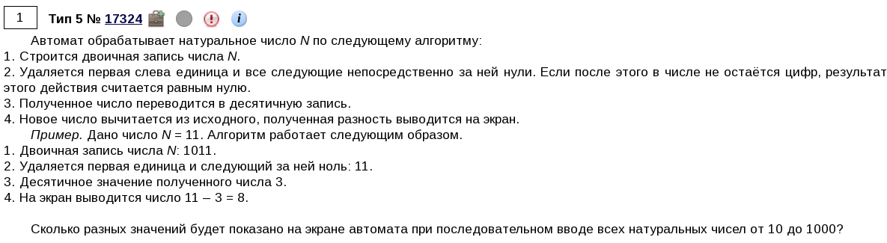
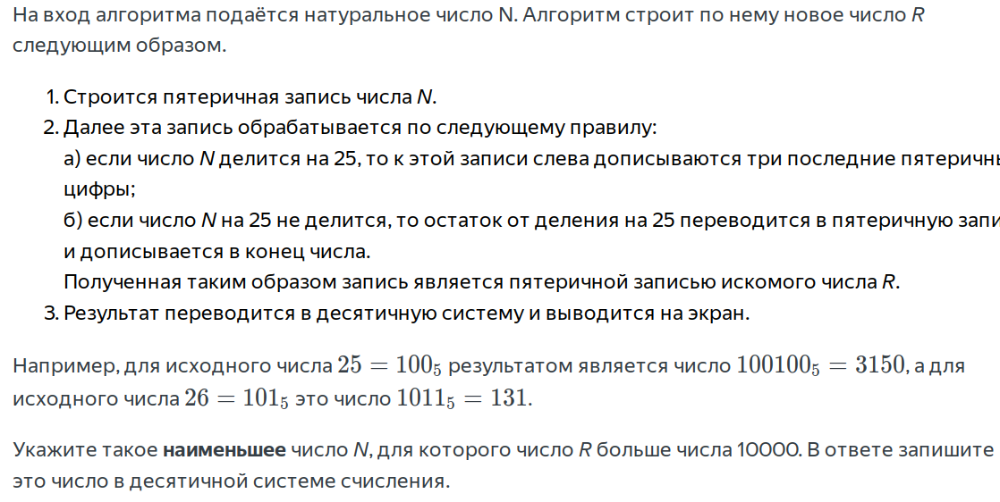
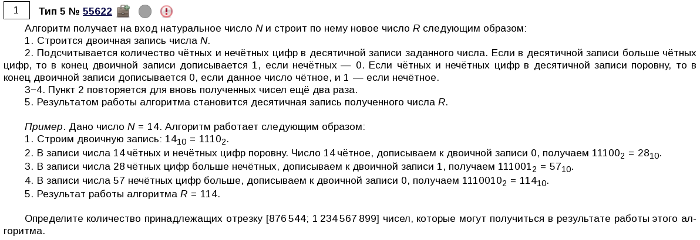

\tableofcontents

\chapter{Решение задач}
\section{Если дан нормальный диапазон}



```{python}
def func(n):
    bin_n = f'{n:b}'  # (1)

    bin_n = bin_n[1:]  # (2)

    ind_one = bin_n.find('1')  # (3)
    bin_n = bin_n[ind_one:]  # (4)

    dec_n = int(bin_n, 2)  # (5)

    return n - dec_n


nums = set()  # (6)
for i in range(10, 1001):
    nums.add(func(i))

print(len(nums))
```

1) Переводим число в двоичную запись, убрав после этого префикс `0b`.
2) Как сказано в задании, нужно убрать единицу. Первой цифрой (логично) будет единица, поэтому делаем срез со второго элемента до конца.
3) Также сказано, что нужно удалить все идущие затем нули. С помощью метода `find` [^1] мы находим индекс первой единицы, которая встретится нам в этой двоичной записи. Если же единица не встретится, то (логично) вся двоичная запись заполнена нулями.
4) Делаем срез так, чтобы он начинался с первой встреченной единицы и до конца. Если же единицы вообще нет, то вся двоичная запись состоит из нулей, а Python возьмет срез от `-1` индекса до конца (что будет равно `'0'`).
5) Переводим получившуюся двоичную запись в десятичную.
6) Используем множество, т.к. в задании сказано, что нужно кол-во *разных* чисел.

[^1]: Если метод `find` не находит нужный элемент, он возвращает `-1`.

\section{Переводим в другие системы счисления}
{width=80%}

```{python}
def convert_to_base(x, base=2):
    result = []  # (1)
    while x > 0:  # (2)
        result.append(str(x % base))  # (3)
        x //= base  # (4)
    return ''.join(result[::-1])


for n in range(1, 10000):
    r = convert_to_base(n, 5)

    if n % 25 == 0:
        r = r[-3:] + r
    else:
        exc = (n % 25)
        converted_exc = convert_to_base(exc, 5)
        r = r + converted_exc

    dec_r = int(r, 5)  # (5)

    if dec_r > 10_000:  # (6)
        print(n)
        break  # (7)
```

- Описание функции для перевода в другую систему счисления [^2]:
1) Создаем переменную, в которую будем записывать данные перевода числа из десятичной СС в другую (`base`).
2) Будем выполнять следующий цикл, пока число больше нуля.
3) Находим остаток от деления текущего числа на СС и записываем его в список с данными для перевода.
4) Делим текущее число на СС для дальнейшего перевода.

[^2]: Далее будет использоваться аббревиатура СС.

- Основной блок алогоритма:
5) Переводим полученную запись в десятичную.
6) Нам нужно минимальное число, которое больше $10000$.
7) Остальные числа нас не интересуют, поэтому завершаем цикл.

\section{Переводим в другие системы счисления \textnumero 2}
{width=100%}

```{python}
def func(n):
    bin_n = f'{n:b}'

    for _ in range(3):  # (1)
        digits = [digit for digit in str(n)]  # (2)
        odd = [digit for digit in digits if int(digit) % 2 != 0]  # (3)
        even = [digit for digit in digits if int(digit) % 2 == 0]

        if len(even) > len(odd):
            bin_n += '1'
        elif len(even) < len(odd):
            bin_n += '0'
        else:
            if n % 2 == 0:
                bin_n += '0'
            else:
                bin_n += '1'

        n = int(bin_n, 2)  # (4)


    return int(bin_n, 2)


def get_n(r):
    EXC_BYTES = 8  # (5)
    round_n = r // EXC_BYTES  # (6)

    for n in range(round_n - 100, round_n + 100):  # (7)
        if func(n) >= r:  # (8)
            return n

r_start = 876_544  # (9)
r_end = 1_234_567_899

start_n = get_n(r_start)  # (10)
end_n = get_n(r_end)

print(end_n - start_n)  # (11)
```

- Описание функции:
1) Всего итераций будет 3.
2) Создаем список со всеми цифрами числа.
3) Находим нечетные и четные цифры.
4) Переводим текущее число в десятичное и обновляем наше предыдущее число.

- Описание функции для получения начальных и конечных значений:
5) Кол-во байтов [^4], которые добавляются после использования нашего алгоритма.
6) Находим примерное первоначальное значение для граничного числа из условия задачи.
7) Для получения более точных данных нужно рассмотреть какой-то диапазон чисел.
8) Если текущее число, переведенное с помощью алгоритма, больше или равно нашему граничному числу из условия задачи, то возвращаем его.

- Основной блок:
9) Сохраняем граничные числа из диапазона.
10) Находим их начальные значения.
11) Т.к. нам нужно кол-во чисел из диапазона этих граничных начальных чисел, то просто вычитаем конец из начала.

[^4]: У нас всего 3 итерации. На каждой добавляется одна цифра в конец. Следовательно, всего добавится 3 цифры. Добавление единицы или нуля увеличивают десятичное число примерно вдвое. Следовательно, 3 итерации увеличат число в 8 раз. Советую посмотреть [\text{\underline{объяснение от Кабанова}}](https://www.youtube.com/live/e6LREsEYSgs?si=0ublQCTc_v0lIxhI&t=6638) на этот счет.

\chapter{Полезные советы}

- Если сказано, что нужно сделать восьмибитовую запись (т.е. заполнить запись лишними нулями в начале), то воспользуйтесь [методом `zfill`](https://docs.python.org/3/library/stdtypes.html#str.zfill).
- Если нужно заменить единицы на нолики и наоборот, то нужно единицы поменять на какую-то другую цифру (например, на 2), затем нолики заменить на единицы, а потом двойки - на нолики.
