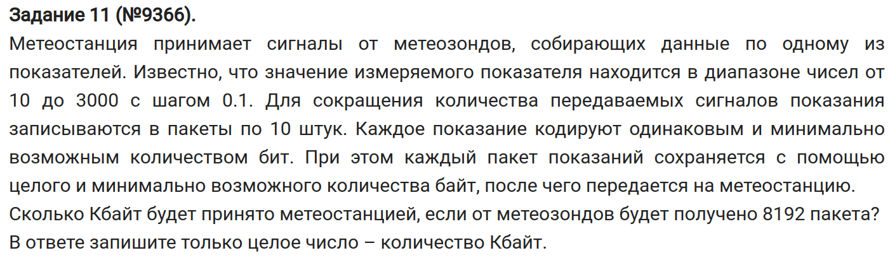

\tableofcontents

\chapter{Маленькое введение}

- Данный документа разработан на основе видео от Евгения Джобса, за что ему огромное спасибо!

\chapter{Посимвольное кодирование информации}

- Один бит - это варианты "да" или "нет".


\center \textit{Как видим, начиная со второй строчки задается условие, ответом на которое является два множества} \center

- Формула Хартли:
$$I = \log_2 N,$$

\begin{center}
где $I$ - сколько бит надо, \\
$N$ - кол-во вариантов.
\end{center}

- $I$ может быть нецелым.

- Формула для вычисления макс. кол-ва значений (комбинаций), которые можно закодировать n-ым кол-вом бит:
$$N_{max} = 2^I$$
$$N \leq 2^I$$

- Важно: если сказано, что пароль хранится в битах, то в байты его переводить не надо (это будет лишним).

\section{Пример задачки}


- $N_{max} = 10000 \Rightarrow i = 14\;\text{бит}$ на одного спортсмена.
- Унас их 68. Значит, $68 \cdot 14 = \boxed{952}$

\section{Еще одна задачка}



1) Найдем общее кол-во сообщений:
```{python}
print(len([i/10 for i in range(10 * 10, 3000 * 10 + 1)]))
```

2) Рассчитаем кол-во бит на каждое показание: $N = 29901 \Rightarrow 2^{15} \Rightarrow i = 15$

3) Найдем вес одного пакета: $10 \cdot 15 = 150 \text{(бит)}$

4) В задании сказано, что каждый пакет сохраняется. Значит, нам надо перевести биты в байты: $150 \text{(бит)} = 18.75 \text{(байт)} \approx 19$

5) Найдем весь 8192 пакетов: $8192 * 19 = 155648 \text{(байт)} = \boxed{152} \text{(Кбайт)}$

\chapter{Кодирование графической информации}

- Кол-во цветов определяет глубину кодирования.
- *Глубина кодирования* - кол-во бит, выделяемых на один пиксель.
- PPI - кол-во пикселей на дюйм. В задачах будет следующее оформление: разрешение $n\cdot m \Rightarrow (n \cdot PPI) \cdot (m \cdot PPI)$.
- Если изменяется в $k$ раз разрешение, то кол-во пикселей в изображении изменяется в $k^2$.

\section{Пример задачки}

\center  \center

- Получаем следующее уравнение:
$$\frac{(n \cdot 300)(m \cdot 300) \cdot 16}{(n \cdot 150)(m \cdot 300) \cdot 16} = \frac{20 \cdot 2^{23}}{x}$$
- Откуда получаем размер полученного после преобразования файла:
$$x = 2.5\;\text{Мбайт} = \boxed{2560}\;\text{Кбайт}$$.

\chapter{Кодирование звуковой информации}

\center {width=55%} \center

- *Частота дискретизации* (Гц) - сколько раз в секунду будет производиться считывание значения амплитуды (горизонтальная амплитуда).
- Квантование амплитуды (вертикальная черта).
- Амплитуда считывается с определенной частотой. Замеры округляются до ближайшего значения уровня амплитуды.
- Разрешение, глубина звука - кол-во бит на один замер.
- Важно: для работы с герцами нужно минуты переводить в секунды.
- Кол-во замеров - время $\times$ частоту (Гц).
- *Моно* - один поток, *стерео* - два потока, *квадро* - четыре потока.

\section{Пример задачи}


- Все четыре канала записывались $5$ минут, имеют $40$ кГц и разрешение $16$ бит.
- $\text{Объем файла} = t \cdot \upsilon \cdot I$
- Один канал равен:
$$ (5 \cdot 60) \cdot 40 \cdot 10^3 \cdot 16 = 192 \cdot 10^6\;\text{бит}$$
- Это для одного канала, а у нас их $4$.
- Определим объем для четырех каналов и переведем ответ в Мбайт:
$$\frac{4 \cdot 192 \cdot 10^6}{2^{23}} \approx 91.55\;\text{Мбайт}$$
- Нам нужно минимальное значение - берем $\boxed{92}\;\text{Мбайт}$.

\chapter{Передача информации}

- Общая формула:
$$\text{Объем документа}\;(S) = \text{скорость передачи}\;(V) \times \text{время передачи}\;(t)$$
;
\section{Пример задачки}

\center  \center

- Скорость передачи в пункт А:
$$V_1 = \frac{1 \cdot \upsilon \cdot t \cdot i}{90}$$
- Скорость передачи в пункт Б:
$$V_2 = \frac{2 \cdot \frac{\upsilon}{1.5} \cdot t \cdot 2i}{120}$$
- Получаем:
$$\frac{V_2}{V_1} = \boxed{2}$$

\section{Пример задачки \textnumero2}

\center  \center

- Найдем скорость передачи файла:
$$\frac{50 \cdot 2^{23}}{60 + 30} \approx 4660337.8\;\frac{\text{бит}}{\text{с}}$$
- Упаковка + передача файла + распаковка = $40$ с.
- Упаковка + распаковка = $13$ с.
- Значит, передача файла = $27$ с. Из этого находим размер упакованного файла:
$$46600337.8 \cdot 27 = 125829120\;\text{бит}=\boxed{15}\;\text{Мбайт}$$

\chapter{Проценты и сжатие файла}

- Если файл А меньше файла В на X процентов, то
$$S_A = \frac{100 - X}{100} \cdot S_B$$
- Если файл А больше файла В на X процентов, то
$$S_A = \frac{100 + X}{100} \cdot S_B$$

\section{Пример задачки}

\center  \center

- Найдем размер исходного файла:
    - Глубина цвета: $2^{11} \Rightarrow 11\;\text{бит}$
    - Получаем: $1200 \cdot 1600 \cdot 11 = 21120000\;\text{бит}$
- Найдем размер сжатого файла:
$$21120000 \cdot 0.79 = 16684800\;\text{бит} = 2036.71875\;\text{Кбайт}$$
- Общий размер:
$$2036.71875 + 20 = 2056.71875\;\text{Кбайт} \approx 2.009\;\text{Мбайт}$$
- Минимальное число - $\boxed{3}\;\text{Мбайт}$.

\section{Пример задачки \textnumero2}

\center  \center

- Если составлять уравнение, то получится следующее:
```{=latex}
\begin{gather*}
25\;\text{Мбайт} \geq (50 \cdot 10^3 \cdot t \cdot 16) \cdot 0.75 + 40\;\text{Кбайт}\\
t = 174.4896\;\text{с} \approx \boxed{2}\;\text{мин}
\end{gather*}
```

\chapter{Дополнительная информация}

- Каждый пиксель может хранить в себе информацию не только о цвете, но и о других параметрах (прозрачности, бите четности и др.). Т.е. один пиксель - это цвет + что-то еще.

\section{Задача на прозрачность}


- Как сказано в задаче, в пикселе, помимо цвета, есть еще параметр прозрачности.
- Получается следующее уравнение:
```{=latex}
\begin{gather*}
i - \text{глубина цвета} \\
210\;\text{Кбайт} \geq 1024 \cdot 120 \cdot (i + 7) \\
i = 7\;\text{бит}
\end{gather*}
```
- Мы нашли глубину цвета, а нам нужно кол-во цветов. Значит,
$$2^7 = \boxed{128}$$

\section{Задача на бит четности}

\center  \center

- Бит четности в данном случае означает, что при наличии трех битов добавляется еще один. Например, БББНБББН, где Б - бит, Н - новый бит.
- Найдем значение пикселя:
$$\frac{2 \cdot 2^{23}}{1024 \cdot 1024} = 16$$
- Распишем значение пикселя с учетом добавленных битов: БББНБББНБББНБББН.
- Получается, что новых битов - 4. Остальные биты - грубина цвета.
- Значит, $2^{12} = \boxed{4096}$

\chapter{Полезные советы}

- Не стоит путать "найдите целое число" и "найдите минимальное число". В первом случае просто находим целое число, во втором - округляем в большую сторону.
- Стоит учитывать, когда именно данные кодируются, сохраняются.
