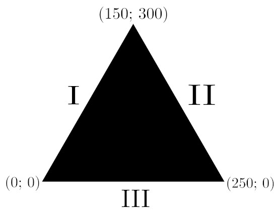
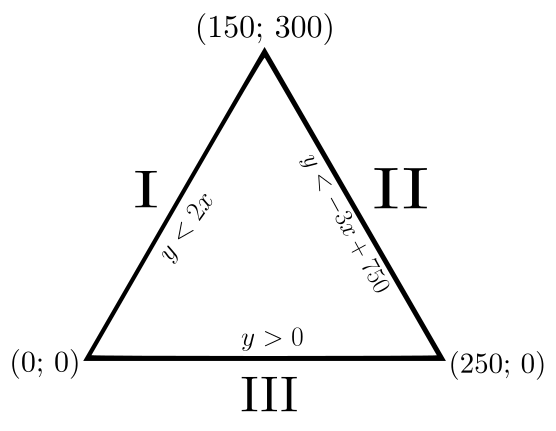

- Если угол поворота равен делителю числа 360, то мы получаем правильный многоугольник.

\newpage
\center \section{Находим кол-во точек в фигуре} \center
- Уравнения для канонической прямой: $\frac{x-x_1}{x_2-x_1} = \frac{y-y_1}{y_2-y_1}$. Это уравнение может пригодиться для задач, где нужно посчитать кол-во точек в фигуре. Берете кол-во точек у фигуры на вершинах и составляете для каждой пары свое уравнение.
- Например,

\center {width=55%} \center

- Составим уравнение для каждой пары (прямой):
$$ I)\;\frac{x - 0}{150 - 0} = \frac{y - 0}{300 - 0} \Rightarrow y = 2x$$
$$ II)\;\frac{x - 150}{250 - 150} = \frac{y - 300}{0 - 300} \Rightarrow y = -3x + 750$$
$$ III)\;y=0 $$
- Следовательно, у точек, котоыре ниже этих прямых, $y$ будет меньше (за исключением $III$ прямой, у которой $y$ должен быть больше).
- Получаем,

\center {width=55%} \center

- Если точки находятся внутри этой фигуры, то все три неравенства должны выполняться.

- Найти кол-во точек можно с помощью Python:

```{python}
p = 0

for x in range(0, 260):
    for y in range(0, 310):
        if (y > 0) and (y < -3 * x + 750) and (y < 2 * x):
            p += 1

print(p)
```
(* берем с запасом на всякий случай)

- Вместо уравнения канонической прямой можно воспользоваться уравнением прямой: $y = kx + b$.
